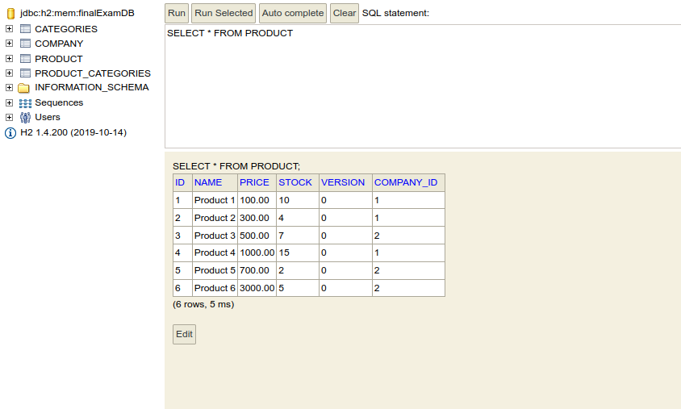
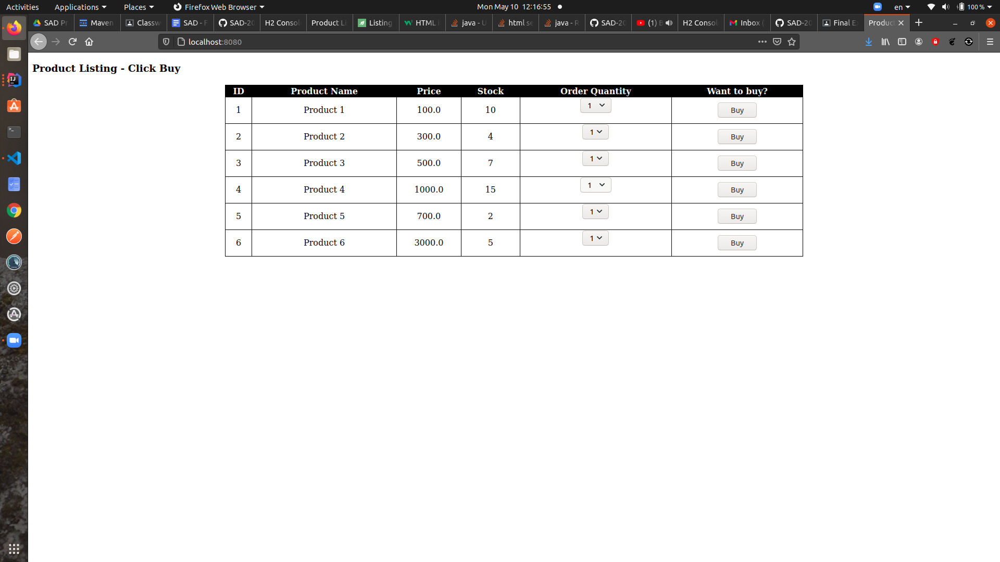

# FINAL EXAM

## What has been Implemented

### 1. Product Model with all the Relational Mappings (Verified in H2 Console about Mappings)
Data is inserted from `data.sql` file

Monetary <---> BigDecimal conversions

### 2. Product Buy page

Dropdown list is populated by stock value

Buy button updates the product's stock based on quantity selected **asynchronously**

### 3. Optimistic and Pessimistic locking strategies with multi threading

These are implemented with async methods and exception handlings while updating the product stock in `ProductService` class.

### 4. Unit Testing

Test methods **are implemented** with assertions.

## What is not completed

### 4. Unit Testing

Demonstration of real exception occurrence through Unit Tests **are NOT completed.**
