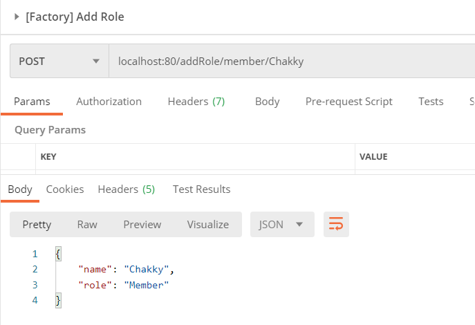

## HW3: Design Patterns and Spring Boot (GUIDE)

---

### 1. BUILDER PATTERN (CREATIONAL)
#### Advantages
* Avoids use of long constructors
* Allows creating objects step by step
* Encapsulates growing list of attributes

#### Without using Lombok
Creating User 1

GET Request for User 1 from Postman

Structure of User with just properties

#### With Lombok
Structure of User with @Builder

Structure of User with @Builder and @Data

GET Request for User 2 from Postman

---

### 2. FACTORY PATTERN (CREATIONAL)

#### Advantages
* Hiding creation logic
* Control creation login only in one place (DRY Principle)
* Adding subclasses require very less change in main class
* Highly reusable

#### When to use?
* When creation logic is complex and want to hide complexity behind
* Not sure which class will be used later
* When class is only chosen at runtime

#### Creating Interface

#### Implementing Interface
Concrete classes implement the interface and has to implement all the required methods

#### Creating RoleFactory
Object creation logic will be handled here. The factory produces required objects.
Role factory is annotated with `@Component`. This is a class level annotation that
tells that this class can be `Autowired` later for dependency injection.

#### Creating Controller
Here we implement a `PostMapping` to set name and check access level using
path variables.

#### Testing POST request with Postman

---

### 3. ADAPTER PATTERN (STRUCTURAL)
#### Advantages
* Makes multiple interfaces compatible
* Allows two unrelated interfaces work together without changing their existing code
* Uses single `Adapter class` to join functionalities of independent or incompatible interfaces / classes

#### Creating TextFormattable Interface

#### Creating CsvFormattable Interface

#### Concrete Classes that implement the respective interfaces

#### Creating CsvAdapter
Here we make CsvFormatter compatible with TextFormattable interface. This is achieved by creating
`CsvAdapterImpl` class that implements `TextFormattable` and takes in `CsvFormattable` object in its constructor.

#### Testing Adapter Pattern

The `NewLineFormatter` formats the lines into new lines.
Next, we create a `CsvFormatter` and pass it to the `CsvAdapter` which implements `TextFormattable` interface.

---

### 4. FACADE PATTERN (STRUCTURAL)

#### Advantages
* Makes client free from internal service dependencies
* Allows changing of internals without affecting the client
* Makes testing easier

Here we use Facade Design Pattern to print different types of report
for different departments.

#### Creating SalesReportHelper and LogisticsReportHelper

These classes will have their own implementation of their methods. The implementation could be like establishing
database connection, they may have to connect to their own databases, or generating reports
according to their specific needs.

#### Making use of Java Enums (Type Safe Practice)
Java enums help us in creating useful cases instead of using String literals directly. This
ensures that we do not make any typo errors while doing stuff.

#### Facade Implementation
Here `Facade` class provides encapsulation and makes it easier for client to use the internal services
without having to know their logical implementations.

The client will only know about `Facade`, but not its internal logics.

This `generateReport()` is a method in `Facade` class, that accepts Service type, Report Type and Date
and hence handles logic for different services.

#### Using Facade to generate different reports

Here the client uses `Facade` to generate the appropriate reports.

---

### 5. STATE DESIGN PATTERN (BEHAVIORAL)
#### Advantages
* Useful when maintaining an entity that contains multiple transition states 
* Avoids coupling between client and state changes
* Encourages developing of abstract class or interface, and defining concrete class that implement abstract
interface or abstract class for each state
  
Here we explore state changes in player attributes in attack, defense and agility

#### Creating Interface
Here we create state interface where we declare methods for changing the state of object that implements this interface

#### Create class that implements State interface

#### Creating an object and invoking methods from the State interface

#### Results after applying different states to the class

---

### 6. OBSERVER PATTERN (BEHAVIORAL)
#### Advantages
* Allows to observe a subject and get notified when subject sends update.
* Reduces coupling

#### Creating Subject interface
This interface is responsible for registering, unregistering and notifying observers.
It also gets update for an observer from the subject

#### Creating Observer interface
This interface is implemented by those concrete classes who subscribe to the specific subject

#### Creating concrete class
Topic is a concrete class which implements subject. Here Topic is a subject and upon its creation,
new empty list is initialized to store observers

#### Creating an observer named TopicSubscriber that observes Topic as subject

#### TopicSubscriber can post messages and notify observers

#### Creating Topic and making observers observe / subscribe to different topics

#### Result: Gets message only when observer is registered and message is posted by the Subjects

  
---

