# HW 4: Domain Model and Data Source

### 1. [Revenue Recognition Script](https://github.com/Suyogyart/SAD-2021/tree/master/HW4/revenue-recognition)
### 2. [Domain Model](https://github.com/Suyogyart/SAD-2021/tree/master/HW4/domain-model)

## Simple Revenue Recognition Principle
* **Revenue** is said to be **earned when product is exchanged**,
    but not when cash is exchanged.
* If cash is paid in advance and product is exchanged later, then it is **Deferred Revenue**.
* If cash is paid later and product is exchanged first, then it is **Accrued Revenue**.

## Useful Resources
[**Martin Fowler's Revenue Recognition Problem**: Domain Logic Patterns](http://lorenzo-dee.blogspot.com/2015/08/domain-logic-patterns.html)

## Web App Outputs
#### Home Page
Here we choose product type, sign date and contract price.

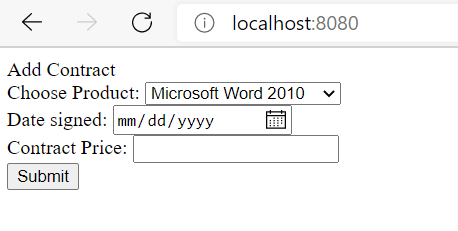

---

#### Selecting MS-Word with prices

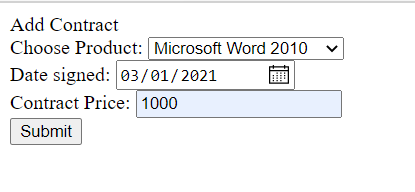

---

#### Check Revenue Recognition for MS Word
As the type is `WORDPROCESSOR`, the revenue is recognized right away using **Complete Recognition Strategy**.

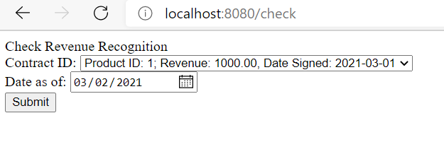
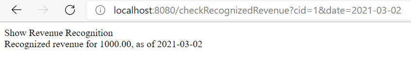

---

#### Selecting MS Excel with prices

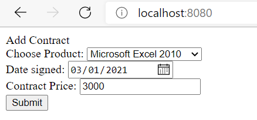

---

#### Check Revenue Recognition for MS Excel
As the type is `SPREADSHEET`, the revenue is recognized using **Three Way Recognition Strategy**.

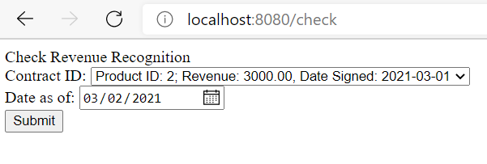
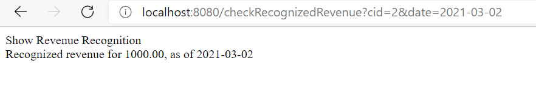
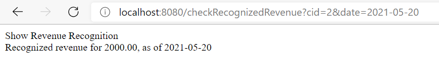
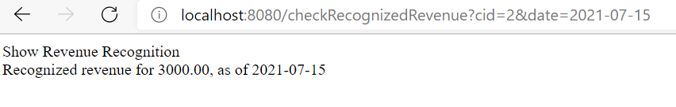

---

#### Selecting Oracle Database with prices

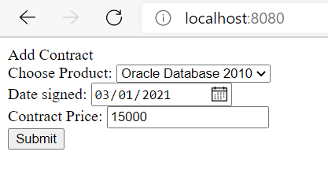

---

#### Check Revenue Recognition for Oracle Database
As the type is `DATABASE`, the revenue is recognized using **Three Way Recognition Strategy**.

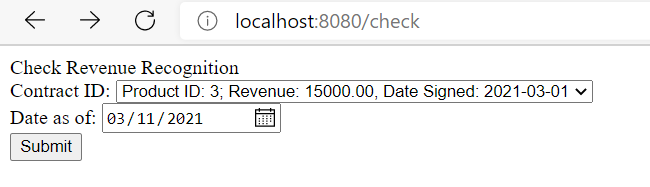
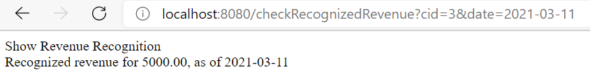
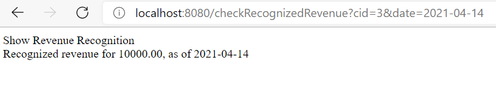
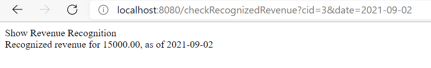

---

### Database Tables in H2 Console

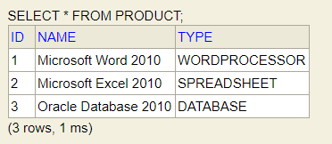
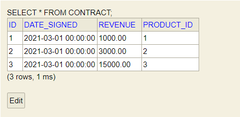
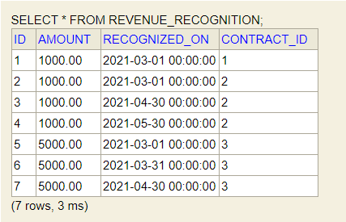

---