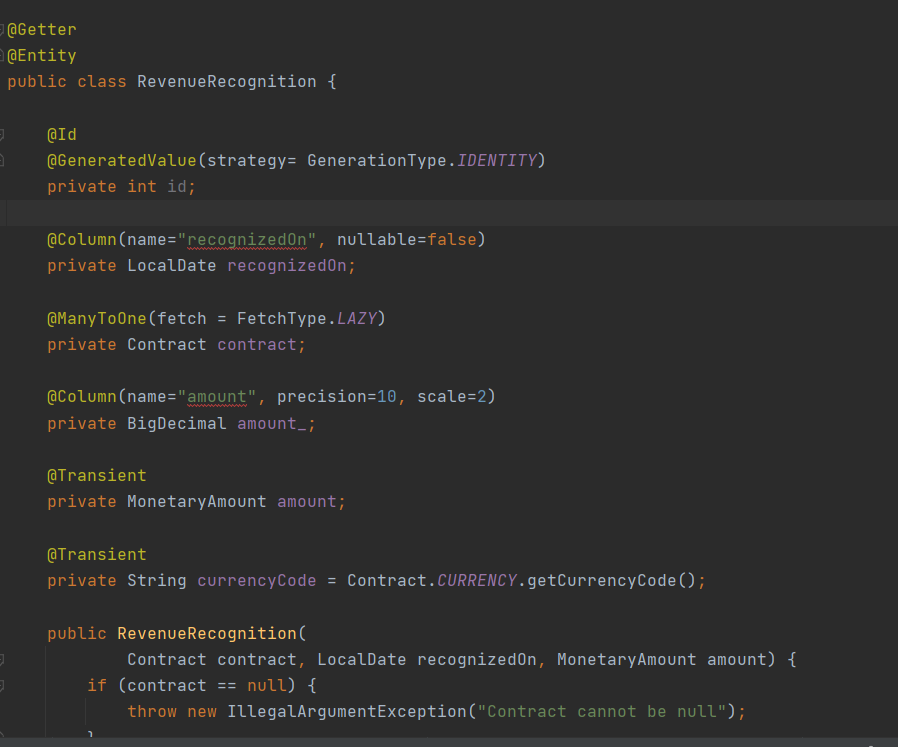

# HW 4 - Revenue Recognition (Domain Model)

## Domain Model
* Object Oriented approach - mingles both data and process.
* Multivalued attributes, complex associations, and inheritances are factored into objects.
* Better to use when we have complex and ever-changing business rules.
* Leverages full power of objects and scales well
* Logic is well organized.

## General Dependencies
1. **Spring Web MVC** for web interfaces.
2. **H2** for in-memory database.
3. **Tomcat Jasper** to load and render JSP pages.
4. **Jackson Dataformat** to allow our RESTful API to work with XML files.
5. **JSTL** for using c-taglib directives in JSP
6. **Lombok** for making things easier for getters and setters.

## Additional Dependencies
1. [Java Money API](https://mvnrepository.com/artifact/org.javamoney/moneta): API for representing, transporting, and performing
   comprehensive calculations with Money and Currency.

2. [Moneta](https://mvnrepository.com/artifact/org.javamoney/moneta): Implements Java Money API.

3. **JPA** for using JPA repositories.

## Models
We create models annotated with `@Entity` to make them as database tables.

### Product
Represents Product table in the database.

`@PostLoad` tells to run that method every time when the product has been loaded.

Here based on different types, revenue is being recognized in three different ways.
1. `WORDPROCESSOR` follows **CompleteRecognitionStrategy**
2. `SPREADSHEET` follows **ThreeWayRecognitionStrategy** with 60 days and 90 days recognition.
3. `DATABASE` follows **ThreeWayRecognitionStrategy** with 30 days and 60 days recognition.

### Contract
Represents Contract table in the database.

`@ManyToOne` annotation for product.
`@OneToMany` annotation with `CascadeType.ALL` and `orphanRemoval = true` for list of revenue recognitions.
`BigDecimal revenue_` is the one that persists in the database, not `MonetaryAmount revenue`.

Business logic is handled for contracts in the same model in different methods.

### Revenue Recognition

Here `fetchType` is set to `Lazy`, so it does not require to load all the revenue recognitions
until it is needed.

`@PrePersist` and `@PostLoad` keeps amount consistent between Monetary and BigDecimal.

## Repository / DAO
Two Repositories used for this app.
1. ProductJpaRepository
2. ContractJpaRepository

## Helper Classes
### Local Date Converter
In our RevenueRecognition model, we have a field type LocalDate. 

Unfortunately, Jpa does not know how to automatically convert LocalDate to sql date.  

Fortunately, JPA is implemented with a default AttributeConverter interface which we can create a class to 
implement this interface, and define the rules to convert LocalDate to sql date.

## Dollar Helper
This helper class is responsible to create the `money` object.

It has two methods that are used to convert between `MonetaryAmount` and `Dollar` data types.

1. `dollars(Number)`: Converts number into MonetaryAmount.
2. `formatAmount(MonetaryAmount)`: Converts MonetaryAmount into numbers with currency symbol according to the Locale set.

## Recognition Strategy
This is an `interface` that is implemented by types of recognition strategies.

Types of strategies are:
1. Complete Recognition Strategy
2. Threeway Recognition Strategy

## Services
A facade is created to help in general logic.

Services help in business logic.

`@Transactional` annotation allows to persist the data even is `save` method is not called.

If we comment this annotation, then above code will give error, and we need to implement `contract.save()` to complete the transaction.

## Controllers
### Home Controller
This controller renders UI for users to interact.

It consists of following request mappings:
1. `/ :: GET`:
   * Allows users to submit contracts using a form.
   * Get products from product repository and pass it to the view named `home.jsp`.

2. `/check :: GET`
   * Can calculate revenue recognition until a certain date
   * Get contracts from contract repository and pass it to the view named `checkrr.jsp`.

### Domain Model Controller

This controller is responsible to handle business logic.

It consists of following request mappings:
1. `/addContract :: GET`:
   * converts the price from int to MonetaryAmount
   * Inserts contract information
   * Calculates revenue Recognitions using Facade.
   * Redirects to `/check` mapping.

2. `/checkRecognizedRevenue :: GET`:
   * Gets recognized revenue for certain contract id as of certain date.
   * Gets the `BigDecimal` number out of recognized revenue.
   * Embeds `revenue` and `date` into a HashMap and attaches into the view.
   * Show `showrr.jsp` page.

## Output
Check Out common [ReadMe.md](https://github.com/Suyogyart/SAD-2021/tree/master/HW4) file to see the program outputs.

