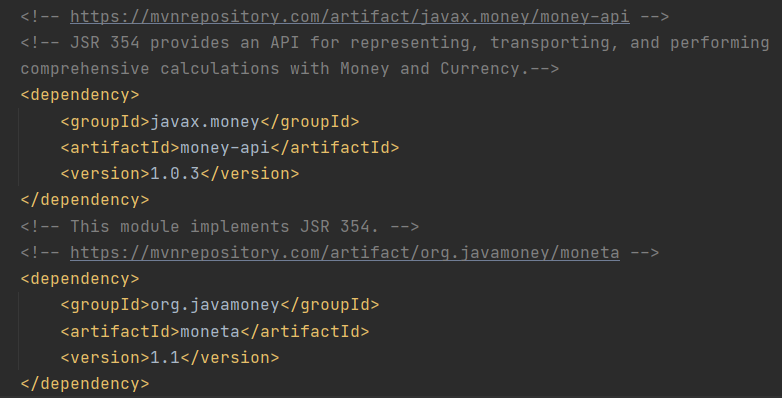
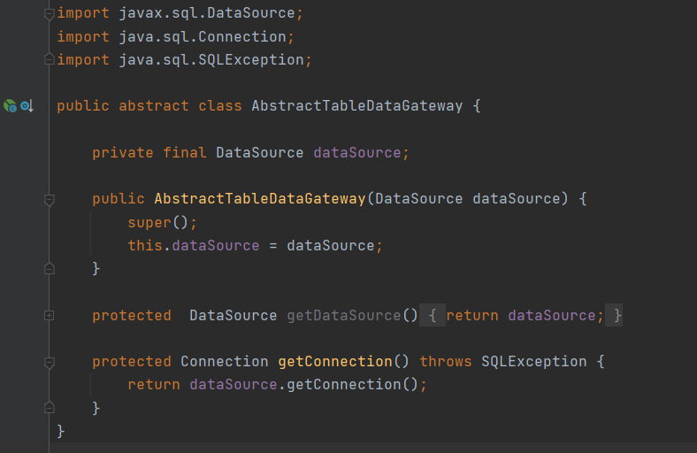

# HW 4 - Revenue Recognition (Transaction Script)

## Transaction Script
* Organizes all business logic into a single request.
* Usually related scripts are enclosed in one class.
* Access database directly via some gateway.
* Should be in classes separate from presentation and data source.

## General Dependencies
1. **Spring Web MVC** for web interfaces.
2. **H2** for in-memory database.
3. **Tomcat Jasper** to load and render JSP pages.
4. **Jackson Dataformat** to allow our RESTful API to work with XML files.
5. **JSTL** for using c-taglib directives in JSP
6. **Lombok** for making things easier for getters and setters.

## Additional Dependencies
1. [Java Money API](https://mvnrepository.com/artifact/org.javamoney/moneta): API for representing, transporting, and performing
   comprehensive calculations with Money and Currency.
   
2. [Moneta](https://mvnrepository.com/artifact/org.javamoney/moneta): Implements Java Money API.

3. **JDBC** for database connection and SQL queries.

## Helper Classes
### Dollar Helper
This helper class is responsible to create the `money` object.

It has two methods that are used to convert between `MonetaryAmount` and `Dollar` data types.

1. `dollars(Number)`: Converts number into MonetaryAmount.
2. `formatAmount(MonetaryAmount)`: Converts MonetaryAmount into numbers with currency symbol according to the Locale set.

### Revenue Recognition Factory
This class will help insert revenue recognition based on different product types.

It has following rules of implementation according to types of product:

1. `WORDPROCESSOR`: Revenue is recognized right away.
2. `SPREADSHEET`: 1/3 Revenue is recognized today, 1/3 in 60 days and 1/3 in 90 days.
3. `DATABASE`: 1/3 Revenue is recognized today, 1/3 in 30 days and 1/3 in 60 days.

>_**Note**: If a contract has any revenue recognitions, the contract's revenue should be equal
> to the sum of its amounts of its revenue recognitions._ 

## Data Gateways
We create an abstract class called `AbstractTableDataGateway` which has a data source that is automatically provided by
the JDBC API.

As this is just an abstract class, it is extended by other data gateways.

### Product Table Data Gateway
This class extends `AbstractTableDataGateway` and inherits the datasource instance and the connection instance.

For its implementation, it consists of following methods:

* `findAll()`: Get all products from database.
* `findOne(product_id)`: Get one product from provided product id.
* `insert(name, type)`: Add new product of *name* and *type* to the database.

### Contract Table Data Gateway
This class also extends `AbstractTableDataGateway` and inherits the datasource instance and the connection instance.

It implements following methods:

* `findAll()`: Get all contracts from database.
* `findOne(contractId)`: Get one contract from provided contract id.
* `insert(productId, contractPrice, dateSigned)`: Add new product of *name* and *type* to the database.

### Revenue Recognition Table Data Gateway
This class also extends `AbstractTableDataGateway` and inherits the datasource instance and the connection instance.

It implements following methods:
* `findByContract(contractId, asOf)`: Find certain contract with given id recognized on given date.
* `insert(contractId, amount, recognizedOn)`: Insert new contract with amount and recognized date.

## Revenue Recognition Script
We will be starting from creating an interface `RevenueRecognitionScript`. Classes implementing this interface are
responsible for
- Getting recognized revenue for specific contract signed on certain date.
- Calculating revenue recognition for certain contracts.
- Inserting new contract information.
- Inserting new product information.

## Concrete Implementation of Revenue Recognition Script
Here, we will create a service, that implements the Revenue Recognition Script interface.
We inject different data gateways like recognition gateway, product gateway and contract gateway to perform
database operations for revenue recognitions.

## Script Controller
This controller is responsible to handle business logic. 

It consists of following request mappings:
1. `/addContract :: GET`:
    * converts the price from int to MonetaryAmount
    * Inserts contract information
    * Calculates revenue Recognitions
    * Redirects to `/check` mapping.
   

    
2. `/checkRecognizedRevenue :: GET`:
    * Gets recognized revenue for certain contract id as of certain date.
    * Gets the `BigDecimal` number out of recognized revenue.
    * Embeds `revenue` and `date` into a HashMap and attaches into the view.
    * Show `showrr.jsp` page.

## Home Controller
This controller renders UI for users to interact. It accesses different Gateways to work together with 
ScriptController

It consists of following request mappings:
1. `/ :: GET`:
    * Allows users to add contracts using a form.
    * We get info from `productGateway` to add particular products.
   

    
2. `/check :: GET`
    * Can check revenue recognition until a certain date
    * We get info from `contractGateway` to check revenue recognition of particular contract until some date.
    

## Output
Check Out common [ReadMe.md](https://github.com/Suyogyart/SAD-2021/tree/master/HW4) file to see the program outputs.

