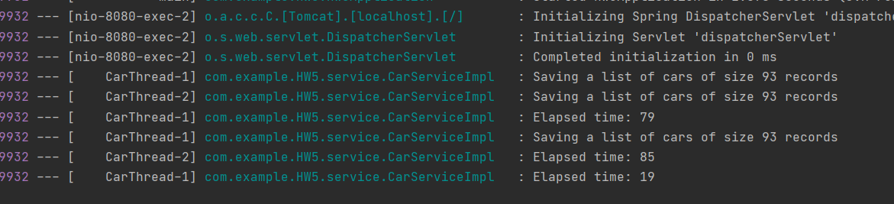
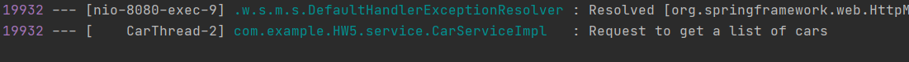
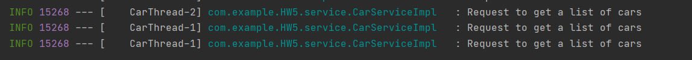

# HW5: Multi-Thread Completable Future

## General Dependencies
1. **Spring Web MVC** for web interfaces.
2. **H2** for in-memory database.
3. **Lombok** for making things easier for getters and setters
4. **JPA** for in-built persistence classes.

## Scenario
We have a Car entity for this scenario with simple attributes.
```java
@Entity
@Data
@NoArgsConstructor
public class Car {

    @Id
    @Column(name = "ID", nullable = false)
    @GeneratedValue(strategy = GenerationType.IDENTITY)
    private long id;

    @NotNull
    @Column(nullable = false)
    private String manufacturer;

    @NotNull
    @Column(nullable = false)
    private String model;

    @NotNull
    @Column(nullable = false)
    private String type;

    public Car(String manufacturer, String model, String type) {
        this.manufacturer = manufacturer;
        this.model = model;
        this.type = type;
    }
}
```

## Configuration File
We configure how our thread should work here.
```java
@Configuration
@EnableAsync
public class AsyncConfiguration {

    private static final Logger LOGGER = LoggerFactory.getLogger(AsyncConfiguration.class);

    @Bean(name = "taskExecutor")
    public Executor taskExecutor() {
        LOGGER.debug("Creating Async Task Executor");
        final ThreadPoolTaskExecutor executor = new ThreadPoolTaskExecutor();
        executor.setCorePoolSize(2);
        executor.setMaxPoolSize(2);
        executor.setQueueCapacity(100);
        executor.setThreadNamePrefix("CarThread-");
        executor.initialize();
        return executor;
    }
}
```

### @EnableAsync 
This annotation enables Spring's ability to run `@Async` methods in the background thread pool

### taskExecutor 
This helps to customize the thread executor by adjusting different thread parameters

### setCorePoolSize
This method sets total number of threads for a pool

### setMaxPoolSize 
When a new task is submitted, and fewer than corePoolSize threads are running, a new thread is created to handle the request, 
even if other worker threads are idle. If there are more than corePoolSize but less than maximumPoolSize threads running, 
a new thread will be created only if the queue is full. By setting corePoolSize and maximumPoolSize the same, you create a fixed-size thread pool. 
By setting maximumPoolSize to an essentially unbounded value such as Integer.MAX_VALUE, you allow the pool to accommodate 
an arbitrary number of concurrent tasks.

### setQueueCapacity
This method is the number of items your threadPool will accept before rejecting them (i.e., throwing exceptions). 
It depends on what behavior you expect : If one task takes one second to complete, and you have 10 threads, that means 
that the 10,000th task in the queue will hopefully be done in 1000 seconds. Is that acceptable ? The worst thing to 
happen is having clients timeout and re-submit the same tasks before you could complete the firsts.

## Service

### Saving cars
This implementation of saveCars will run in the background due to `@Async` annotation and will only do
the callback once it's done via a completedFuture method.

```java
class CarServiceImpl {
    @Override
    @Async
    public CompletableFuture<List<Car>> saveCars(final InputStream inputStream) throws Exception {
        final long start = System.currentTimeMillis();
        List<Car> cars = parseCSVFile(inputStream);
        LOGGER.info("Saving a list of cars of size {} records", cars.size());
        cars = carRepo.saveAll(cars);
        LOGGER.info("Elapsed time: {}", (System.currentTimeMillis() - start));
        return CompletableFuture.completedFuture(cars);
    }
}
```

### Accepting multipart file as input
Here we accept some file as input and thus have `InputStream` type as our argument.

```java
class CarServiceImpl {
    private List<Car> parseCSVFile(final InputStream inputStream) throws Exception {
        final List<Car> cars = new ArrayList<>();
        try (final BufferedReader br = new BufferedReader(new InputStreamReader(inputStream))) {
            String line;
            while ((line=br.readLine()) != null) {
                final String[] data = line.split(";");
                final Car car = new Car(data[0], data[1], data[2]);
                cars.add(car);
            }
            return cars;
        } catch (final IOException e) {
            LOGGER.error("Failed to parse CSV file {}", e);
            throw new Exception("Failed to parse CSV file {}", e);
        }
    }
}
```

### Getting all cars
This is another async implementation to get all cars from the database. To demonstrate the usage of thread, we have set
only two threads as in the **setCorePoolSize** and **setMaxPoolSize**.

So we insert a sleep period for a thread to demonstrate long process.

```java
class CarServiceImpl {
    @Override
    @Async
    public CompletableFuture<List<Car>> getAllCars() throws InterruptedException {
        LOGGER.info("Request to get a list of cars");
        final List<Car> cars = carRepo.findAll();
        Thread.sleep(10000L);
        return CompletableFuture.completedFuture(cars);
    }
}
```

## Controller

### Uplaod File
```java
class CarController {
    
    @RequestMapping(method = RequestMethod.POST,
            consumes = {MediaType.MULTIPART_FORM_DATA_VALUE},
            produces = {MediaType.APPLICATION_JSON_VALUE})
    public ResponseEntity uploadFile(@RequestParam(value = "files")MultipartFile[] files) {

        try {
            for (final MultipartFile file : files) {
                carService.saveCars(file.getInputStream());
            }
            return ResponseEntity.status(HttpStatus.CREATED).build();
        } catch (Exception e) {
            return ResponseEntity.status(HttpStatus.INTERNAL_SERVER_ERROR).build();
        }
    }
}
```

#### ResponseEntity
It represents an HTTP response, including headers, body and status which will be used to indicate
success or failures in saving the files.

#### Multipart
It is the representation of an uploaded file in received in an HTTP multipart request.

#### Output
We hit the POST method with some csv files in our api and we can see that
only two threads are accepting the jobs simultaneously without waiting for the results.
As our maxPoolSize is 2, the last job has to wait for atleast one thread to be free.



### Get all Cars
Adding the method for GET request

```java
class CarController {
    @RequestMapping(method = RequestMethod.GET,
            consumes = {MediaType.APPLICATION_JSON_VALUE},
            produces = {MediaType.APPLICATION_JSON_VALUE})
    @ResponseBody
    public ResponseEntity getAllCars() throws InterruptedException {

        return carService.getAllCars().<ResponseEntity>thenApply(ResponseEntity::ok)
                .exceptionally(handleGetCarFailure);
    }

    private static Function<Throwable, ? extends ResponseEntity<List<Car>>> handleGetCarFailure = throwable ->  {
        LOGGER.error("Failed to read records: {}", throwable);
        return ResponseEntity.status(HttpStatus.INTERNAL_SERVER_ERROR).build();
    };
}
```
- You can attach a callback to the CompletableFuture using thenApply(), thenAccept() and thenRun() methods, for example:
  - CompletableFuture.thenApply().thenAaccept.thenRun().exceptionally(throws new Exception()).build()

- You can use the thenApply() method to process and transform the result of a CompletableFuture when it arrives. 
  It takes a Function<T,R> as an argument. Function<T,R> is a simple functional interface representing a function that 
  accepts an argument of type T and produces a result of type R
  
- If you don’t want to return anything from your callback function and just want to run some piece of code after the 
  completion of the Future, then you can use thenAccept() and thenRun() methods. These methods are consumers and are 
  often used as the last callback in the callback chain.
  
- CompletableFuture.thenAccept() takes a Consumer<T> and returns CompletableFuture<Void>. 
  It has access to the result of the CompletableFuture on which it is attached.

- While thenAccept() has access to the result of the CompletableFuture on which it is attached, 
  thenRun() doesn’t even have access to the Future’s result. It takes a Runnable and returns CompletableFuture<Void> -

- The exceptionally() callback gives you a chance to recover from errors generated from the original Future.
  You can log the exception here and return a default value.
  
#### Output



### Fire three jobs asynchronously
To demonstrate how the thread asynchronously works, let’s modify the GET method to run three jobs.
Here we created three CompletableFuture jobs to retrieve all cars
`.allOf` will wait until all three jobs are done, and then perform join

```java
class CarController {
    @RequestMapping(method = RequestMethod.GET,
            consumes = {MediaType.APPLICATION_JSON_VALUE},
            produces = {MediaType.APPLICATION_JSON_VALUE})
    public ResponseEntity getAllCars() throws InterruptedException {

        CompletableFuture<List<Car>> cars1 = carService.getAllCars();
        CompletableFuture<List<Car>> cars2 = carService.getAllCars();
        CompletableFuture<List<Car>> cars3 = carService.getAllCars();
        CompletableFuture.allOf(cars1, cars2, cars3).join();
        return ResponseEntity.status(HttpStatus.OK).build();
    }
}
```

#### Output



Note the thread numbers of the first two as compared to the last one.
Two thread simultaneously run but the last job has to wait until the threads are free.
