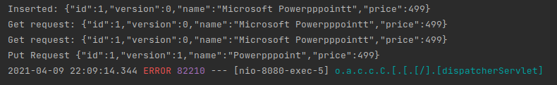
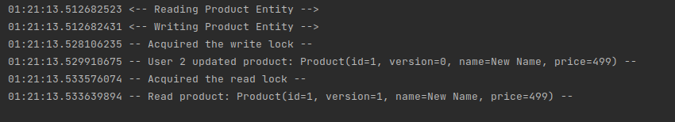
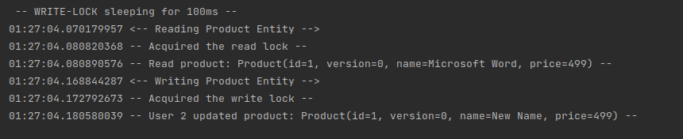
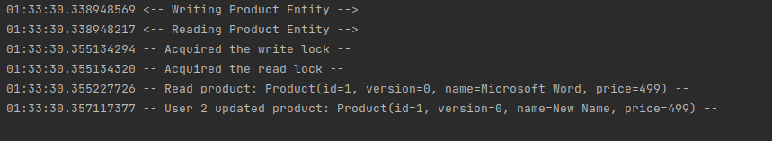
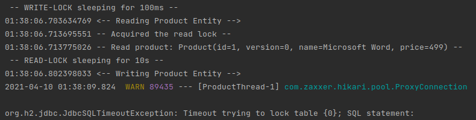
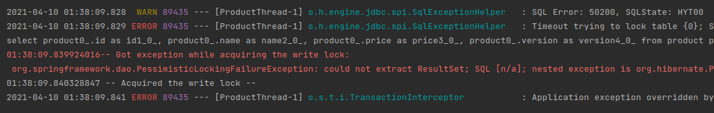

# HW6: Optimistic and Pessimistic Locking

### Optimistic Locking
Optimistic Locking does not lock out any resources. Instead, it resolves conflict when it finds one.  It uses @version to keep track of any possible inconsistent states of objects.

### Pessimistic Locking
Pessimistic Locking locks out resources. Write lock and read lock are the two most common locks. In read lock, any other transactions can read but not write. On the other hand, in write lock, no other transactions can read nor write. Spring implements pessimistic locking using @Lock at the repository query.

## Dependencies
1. **Lombok** - for reducing boilerplate code
2. **JPA** - for repository pattern
3. **H2** - in-memory database (feel free to use others)
4. **Spring Web** - provides controllers and MVC support

## Application Properties

```text
spring.h2.console.enabled=true
spring.datasource.platform=h2
spring.datasource.url=jdbc:h2:mem:oplock;LOCK_TIMEOUT=1000
```

`LOCK_TIMEOUT` is specified to 1000ms.  This is informing h2 that or our pessimistic locking, the lock wait time is 1 second.  If the lock wait time is beyond 1 second and is blocking another instance, it shall raise an exception

## Model
This is simple `Product.java` class. 

```java
@Entity
@Data
@NoArgsConstructor
public class Product {

    @Id
    @GeneratedValue(strategy = GenerationType.IDENTITY)
    private Long id;

    @Version
    private Long version;

    private String name;

    private Long price;
}
```
**@Version** annotation here assumes a column in the database exists to represent the field that the annotation is tagged to.

The JPA takes care of incrementing the version as well as all the version checking upon save.

>**Note:** We *MUST NOT* manually update or increment version by ourselves. When we manually create any object through `data.sql`, me must set the version to **0**.

## Controller
We have the controller with three mappings. 
1. `/products/{id} (GET)`: Find product by id.
2. `/products (PUT)`: Update product.
3. `/products (POST)`: Save product.

## Defining Request handlers

### Global HttpClient and ObjectMapper
```text
static HttpClient client = HttpClient.newHttpClient();
static ObjectMapper mapper = new ObjectMapper();
```
1. **HttpClient**: Make restful calls to our controller APIs
2. **ObjectMapper**: Transform JSON into Java objects.

### Method to Send HTTP requests
```text
private static String sendRequest(HttpRequest request) throws IOException, InterruptedException {
    HttpResponse<String> response = client.send(request, HttpResponse.BodyHandlers.ofString());
    return response.body();
}
```
**HttpClient** is used to send the request, which returns an `HttpResponse`

### JSON builder and ObjectMapper
We have a custom JSON Builder that builds JSON string from the Java object and in complement to it ObjectMapper class transforms the Java object to the JSON representation.

### HTTP Requests
```text
private static void insert(String name, int price) throws IOException, InterruptedException {
    // JSON formatted data
    String json = makeJSON(name, price);

    HttpRequest request = HttpRequest.newBuilder()
        .POST(HttpRequest.BodyPublishers.ofString(json))
        .uri(URI.create("http://localhost:8080/products"))
        .setHeader("User-Agent", "Java 11 HttpClient SRT Bot")
        .header("Content-Type", "application/json")
        .build();
        
    System.out.println("Inserted: " + sendRequest(request));
```
**HttpRequest** is a builder wrapper for creating Http requests with `.uri` setting the restful path and `.POST` as method type.

The header specifying **Content-Type**  is set to `application/json` to ensure that it will accept JSON strings.

In the similar way, `.PUT` and `.GET` methods are handled simulating the request sending behavior.

## Service
This service class implements the Asynchronous methods

### Read Lock Transaction
```java
class ProductServiceImpl implements ProductService {
    @Transactional
    @Async
    public void readLockTransaction() throws InterruptedException {
        System.out.println(LocalTime.now() + "<-- Reading Product Entity");

        Product product1 = null;
        try {
            product1 = productRepo.findProductForRead(1L);
        } catch (Exception e) {
            System.err.println(LocalTime.now() + "-- Got exception while " + "acquiring the read lock:\n " + e + " --");
        }

        System.out.println(LocalTime.now() + " -- Acquired the read lock --");
        System.out.println(LocalTime.now() + " -- Read product: " + product1 + " --");
        Thread.sleep(10000);
    }
}
```
Here we are reading a product, which acquires a read lock. Thus, any other transaction will not be able to write, until the lock is released (i.e., timeout).

### Write lock transaction

```java
class ProductServiceImpl implements ProductService {
    @Transactional
    @Async
    public void writeLockTransaction() throws InterruptedException {
        Thread.sleep(100L);
        System.out.println(LocalTime.now() + "<-- Writing Product Entity");

        Product product2 = null;
        try {
            product2 = productRepo.findProductForWrite(1L);
        } catch (Exception e) {
            System.err.println(LocalTime.now() + "-- Got exception while " + "acquiring the write lock:\n " + e + " --");
        }

        System.out.println(LocalTime.now() + " -- Acquired the write lock --");
        product2.setName("New Name");
        productRepo.save(product2);

        System.out.println(LocalTime.now() + " -- User 2 updated product: " + product2 + " --");
    }
}
```
Here we are acquiring a write-lock, before updating the product and saving it.


## Demonstration of Optimistic Locking
```java
public class LockingApplication {

    static HttpClient client = HttpClient.newHttpClient();
    static ObjectMapper mapper = new ObjectMapper();

    public static void main(String[] args) throws IOException, InterruptedException {
        SpringApplication.run(LockingApplication.class, args);

        // POST
        insert("Microsoft Powerpppointt", 499);

        // GET
        String jsonPowerPoint = get(1);
        Product pro = mapper.readValue(jsonPowerPoint, Product.class);
        pro.setName("Powerpppoint");

        String jsonPowerPoint2 = get(1);
        Product pro2 = mapper.readValue(jsonPowerPoint2, Product.class);
        pro2.setName("Powerpoint");

        // PUT (the version will increment automatically)
        update(convertObjectToJSON(pro));

        // PUT (this will raise an error because the version is different)
        update(convertObjectToJSON(pro2));

    }
}
```

- We first added some data to our H2 Database
- The we get two copies of the same instance, simulating an concurrent situation.
- The first update will pass through nicely.
- However, the second update fails, because Spring detects from the version number that is older than current one.



Here we run into exception when second update happens, and we get this error.

>org.springframework.orm.ObjectOptimisticLockingFailureException: Object of class [com.example.Locking.model.Product] with identifier [1]: optimistic locking failed; nested exception is org.hibernate.StaleObjectStateException: Row was updated or deleted by another transaction


## Demonstration of Pessimistic Locking

### Asynchronous Configuration
To simulate a concurrent situation, let’s use **@Async** to simulate two threads.

```java
@Configuration
@EnableAsync
public class AsynConfiguration {
    private static final Logger LOGGER = LoggerFactory.getLogger(AsynConfiguration.class);

    @Bean(name = "taskExecutor")
    public Executor taskExecutor() {
        LOGGER.debug("Creating Async Task Executor");
        final ThreadPoolTaskExecutor executor = new ThreadPoolTaskExecutor();
        executor.setCorePoolSize(2);
        executor.setMaxPoolSize(2);
        executor.setQueueCapacity(100);
        executor.setThreadNamePrefix("ProductThread-");
        executor.initialize();
        return executor;
    }
}
```

- The `@EnableAsync` annotation enables Spring’s ability to run @Async methods in a background thread pool.
- The bean `taskExecutor` helps to customize the thread executor such as configuring number of threads for an application, queue limit size and so on. Spring will specifically look for this bean when the server is started. _If this bean is not defined, Spring will create SimpleAsyncTaskExecutor by default._
- `setCorePoolSize` set the number of threads
- `setMaxPoolSize` - When a new task is submitted, and fewer than corePoolSize threads are running, a new thread is created to handle the request, even if other worker threads are idle. If there are more than corePoolSize but less than maximumPoolSize threads running, a new thread will be created only if the queue is full. By setting corePoolSize and maximumPoolSize the same, you create a fixed-size thread pool. By setting maximumPoolSize to an essentially unbounded value such as Integer.MAX_VALUE, you allow the pool to accommodate an arbitrary number of concurrent tasks.
- `setQueueCapacity` is the number of items your threadPool will accept before rejecting them (i.e., throwing exceptions). It depends on what behavior you expect : If one task takes one second to complete, and you have 10 threads, that means that the 10,000th task in the queue will hopefully be done in 1000 seconds. Is that acceptable ? The worst thing to happen is having clients timeout and re-submit the same tasks before you could complete the firsts.

### Putting @Lock to query

For the default api that is created by JpaRepository, if we would like to apply @Lock, we can simply explicitly spell them out, and apply **@Lock** on top of those apis.

```java
@Repository
public interface ProductRepo extends JpaRepository<Product, Long> {

    // A PESSIMISTIC_WRITE lock request fails if another user currently holds either a
    // PESSIMISTIC_WRITE lock or a PESSIMISTIC_READ lock on that database object.
    @Lock(LockModeType.PESSIMISTIC_WRITE)
    @Query("select p from Product p where p.id = :id")
    Product findProductForWrite(@Param("id") Long id);


    // A PESSIMISTIC_READ lock request fails if another user currently holds a
    // PESSIMISTIC_WRITE lock on that database object.
    @Lock(LockModeType.PESSIMISTIC_READ)
    @Query("select p from Product p where p.id = :id")
    Product findProductForRead(@Param("id") Long id);

}
```

- We have defined two similar queries, but the difference is one is using write lock, while another is using a read lock, which are the **two most common locks for pessimistic locking**
- A `PESSIMISTIC_READ` lock request fails if another user currently holds a PESSIMISTIC_WRITE lock on that database object.
- A `PESSIMISTIC_WRITE` lock request fails if another user currently holds either a PESSIMISTIC_WRITE lock or a PESSIMISTIC_READ lock on that database object.

### Another Main Program to test Pessimistic Locking
Here we create another simple main class to test the behavior of objects in pessimistic locking.

```java
public class MainLocking {
    public static void main(String[] args) throws InterruptedException {
        ConfigurableApplicationContext applicationContext = SpringApplication.run(LockingApplication.class, args);
        ProductServiceImpl ps = applicationContext.getBean(ProductServiceImpl.class);

        ps.createMockProduct();
        ps.writeLockTransaction(); // This write lock will block the read block
        ps.readLockTransaction();
    }
}
```

### When WRITE-LOCK takes precedence



it will look like this (it really depends on which threads goes first), where read lock can only be acquired once write lock is release at the end of write transaction.

### When READ-LOCK takes precedence



Here reading takes precedence so Read-lock blocks other write locks. Or, the write operation needs to wait until read completes its transaction.

### Inconsistent READ-WRITE transactions



Here if we comment @Lock from the Repo and comment out the Thread.sleep(100L) from writeLockTransaction to make sure both threads start the same. It is chaotic, as we never can ensure on the order of read and write, which can lead to inconsistent updates/reads.

### Triggering PessimisticLockingException



Here we are simulating a case where readLockTransaction will take precedence, but will keep the lock for 10000ms more until the transaction ends. 



Since this 10000ms greatly exceeds the 1000ms we specify in the application.properties, it will raise an exception, as acquiring the write lock goes beyond the wait time of 1000ms. The locktimeout includes other methods doing something. For example, if we specify sleep for 2000ms, it will still be fine. It is suspected that there are a few more second of some methods performing something
