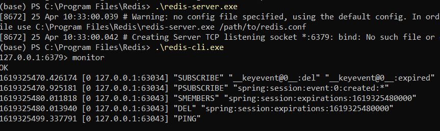
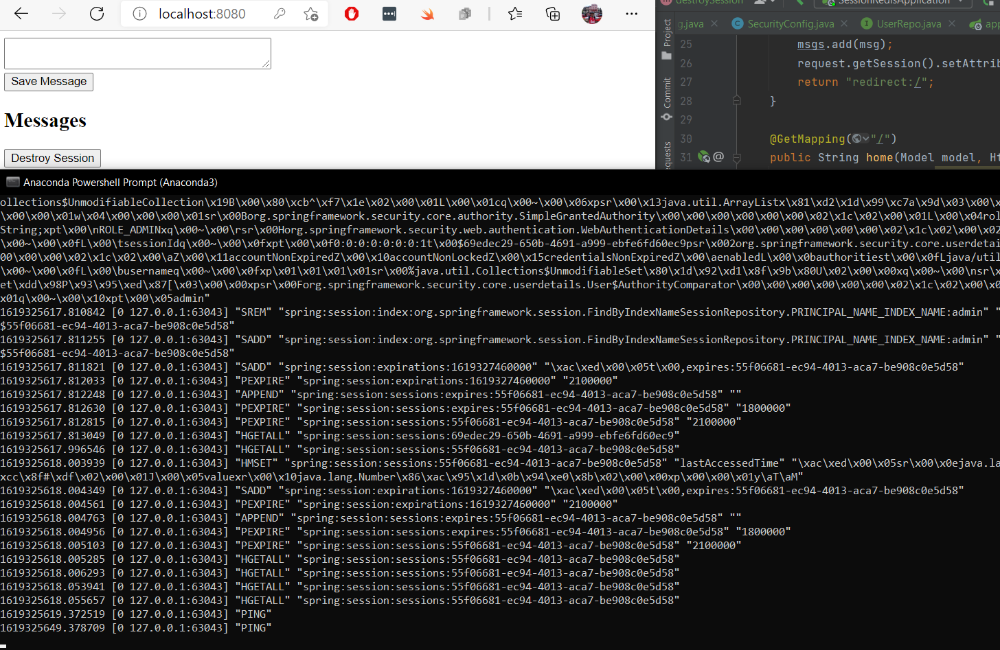
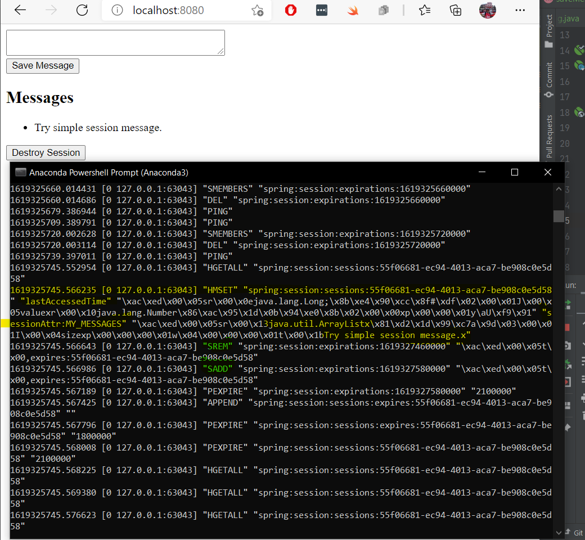
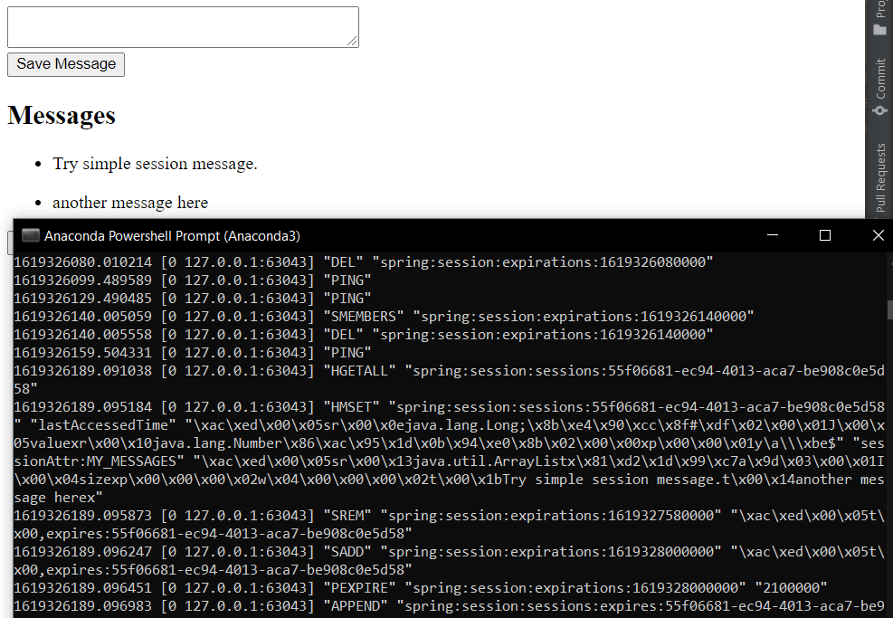

# HW7: Spring Session Assignment (Implementation Using Redis)

## Spring Session

Spring Session has the simple goal of free up session management from the limitations of the HTTP session stored in the
server.

The solution makes it easy to share session data between services in the cloud without being tied to a single container
(i.e. Tomcat). Additionally, it supports multiple sessions in the same browser and sending sessions in a header.

Here we use Spring Session to manage authentication information in a web app. While Spring Session can persist data
using JDBC, Gemfire, or MongoDB, here we use Redis.

## Additional Dependencies

```xml
<dependencies>
    <dependency>
        <groupId>org.springframework.boot</groupId>
        <artifactId>spring-boot-starter-data-redis</artifactId>
    </dependency>

    <dependency>
        <groupId>org.springframework.session</groupId>
        <artifactId>spring-session-data-redis</artifactId>
    </dependency>

    <dependency>
        <groupId>org.springframework.session</groupId>
        <artifactId>spring-session</artifactId>
        <version>1.3.5.RELEASE</version>
    </dependency>
    <dependency>
        <groupId>org.springframework.data</groupId>
        <artifactId>spring-data-redis</artifactId>
        <version>2.3.9.RELEASE</version>
    </dependency>
    <!-- https://mvnrepository.com/artifact/redis.clients/jedis -->
    <dependency>
        <groupId>redis.clients</groupId>
        <artifactId>jedis</artifactId>
        <version>3.6.0</version>
    </dependency>
</dependencies>
```

## application.properties

```properties
spring.redis.host=localhost
spring.redis.port=6379
```

## Spring Session Configuration
```java
@Configuration
@EnableRedisHttpSession
public class SessionConfig extends AbstractHttpSessionApplicationInitializer {

    @Bean
    public JedisConnectionFactory connectionFactory() {
        return new JedisConnectionFactory();
    }
}
```
`@EnableRedisHttpSession` and the extension of `AbstractHttpSessionApplicationInitializer` will create 
and wire up a filter in front of all our security infrastructure to look for active sessions 
and populate the security context from values stored in Redis.

## Controller
For the controller class, we use the same controller path configurations as in the
[SessionController in HW7 Guide](https://github.com/Suyogyart/SAD-2021/blob/master/HW7/HW7_Guide/src/main/java/com/example/session/controller/SessionController.java)

## Spring Security Basic Authentication

```java
@EnableWebSecurity
@Configuration
public class SecurityConfig extends WebSecurityConfigurerAdapter {

    @Bean
    public BCryptPasswordEncoder bCryptPasswordEncoder() {
        return new BCryptPasswordEncoder();
    }

    @Autowired
    public void configureGlobal(AuthenticationManagerBuilder auth) throws Exception {
        auth
                .inMemoryAuthentication()
                .withUser("admin")
                .password(bCryptPasswordEncoder().encode("password"))
                .roles("ADMIN");
    }

    @Override
    protected void configure(HttpSecurity http) throws Exception {
        http
                .httpBasic()
                .and()
                .authorizeRequests()
                .antMatchers("/**").hasRole("ADMIN")
                .anyRequest().authenticated();
    }
}
```

## Redis Installation (Windows)
We can install Redis client and server from this link:

[Download Redis for Windows](https://github.com/microsoftarchive/redis/releases)

Once downloaded and installed, we can start up Redis server and enter its
command line interface.

It will be started as `localhost` in port `6379`. Make sure you configure this in
your `application.properties` file in Spring Boot.

Use `monitor` command to see logs of connections and other hits from clients.



## Running Spring Boot App and Accessing Endpoints

Enter the username and password as configured in the `SecurityConfig` file, and you are good to go.



Spring Boot app acts like a client so, it connects with the Redis server running in the localhost.
As soon as we access some endpoint, it starts logging different messages in its CLI.

## Adding a message through our UI

When we add some messages, the Redis monitoring will produce certain logs as highlighted below.

We can see, `MY_MESSAGES` as a session attribute that stores an `ArrayList` being logged with the message we typed. 
Its now added and stored in the Redis store.



Similarly, adding another messages.



## Invalidating the session
We can destroy all session attributes using `invalidate()` method. The Redis console will 
log the messages accordingly.

## References
1. [Introduction to Spring Data Redis](https://www.baeldung.com/spring-data-redis-tutorial)
2. [Guide to Spring Session](https://www.baeldung.com/spring-session)
3. [Redis](https://redis.io/)