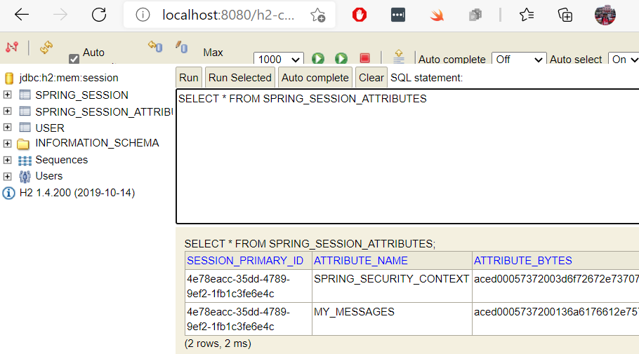

# HW7: Spring Session Guide (Implementation using JDBC)

We will be making use of `HttpSession` to achieve Session management.
Spring Session consists of the following modules:

We will be using Spring Session JDBC to store spring session information. 
By default Apache Tomcat stores HTTP session objects in memory.  Instead of memory, we will be using DB session state.


## Dependencies
1. **Lombok** - for reducing boilerplate code
2. **JPA** - for repository pattern
3. **H2** - in-memory database (feel free to use others)
4. **Spring Web** - provides controllers and MVC support
5. **Spring Security** - provides built-in authentication-authorization
6. **Thymeleaf** - template engine (we have been using jsp a lot, let’s use another template engine) - html based - provides a lot of logic
7. **Rest Repositoriesb** - auto configure a restful apis for the model without the need of controllers
8. **Spring Session** - provides session support

## Application Properties

```text
spring.h2.console.enabled=true
spring.datasource.platform=h2
spring.datasource.url=jdbc:h2:mem:session

spring.session.store-type=jdbc
```

`spring.session.store-type=jdbc` is added to make sure Spring Boot implements session
under the hood with the datasource defined

## Spring Security

Spring security is configured here with previously done implementations.

## Model
This is simple `User.java` class implemented for the purpose of storing user information
required by Spring Security.

## Spring Session

After running our app, we now see two more tables.
1. **SPRING_SESSION** - Spring keeps all the session id variables
2. **SPRING_SESSION_ATTRIBUTES** - Spring keeps all the model attributes

## Session Controller
We have the controller with three mappings.
1. **/saveMessage (POST)**:
   Here we are autowiring HttpServletRequest to retrieve the session variables. 
   Note the difference between HttpServletRequest and HttpSession, which can both set and get session attributes. 
   We use HttpServletRequest to store data that is specific to a HTTP request (e.g., through restful apis); 
   the lifetime ends when the request is finished.  We use HttpSession when dealing with global HTTP sessions 
   (e.g., logged-in user, user settings).  The lifetime is until the connection between client/server is closed.
   If the session attribute of MY_MESSAGES is null (i.e., first time), we initialize it.  
   Then we add msg to the ArrayList and refresh the page.
   
   
2. **/ (GET)**:
Shows form to add messages and retrieves info from the session attributes using
   `getAttribute()` method. Notice we use HttpSession since there is no request incoming.
   

3. **/invalidate (POST)**:
Destroys all session attributes using `invalidate()` method.
   
## Results

After adding some messages, in `h2 console` we can see that Spring stores an attribute named
`MY_MESSAGES` in its table automatically.

