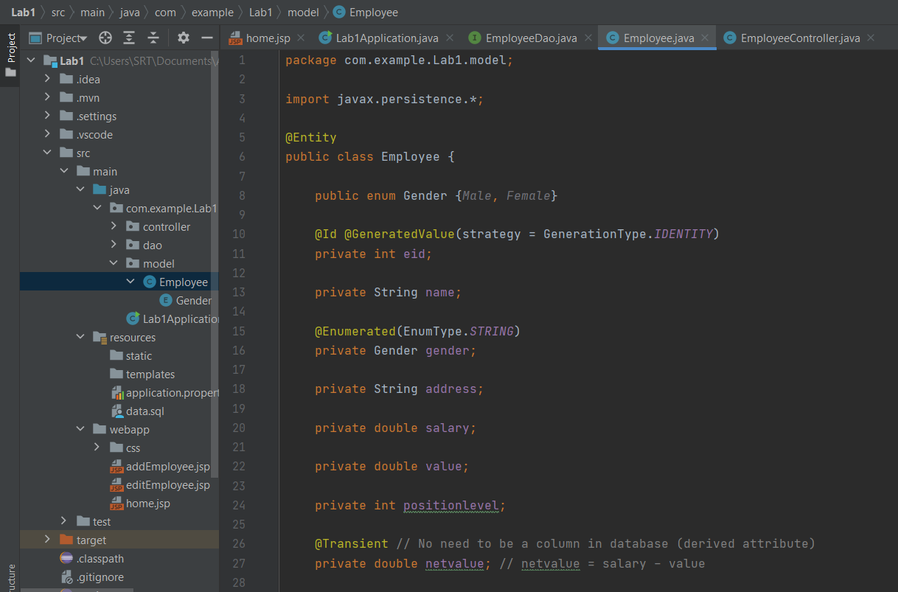
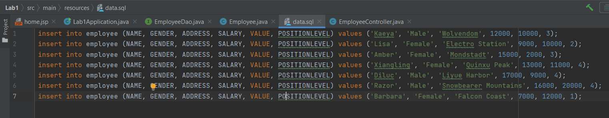
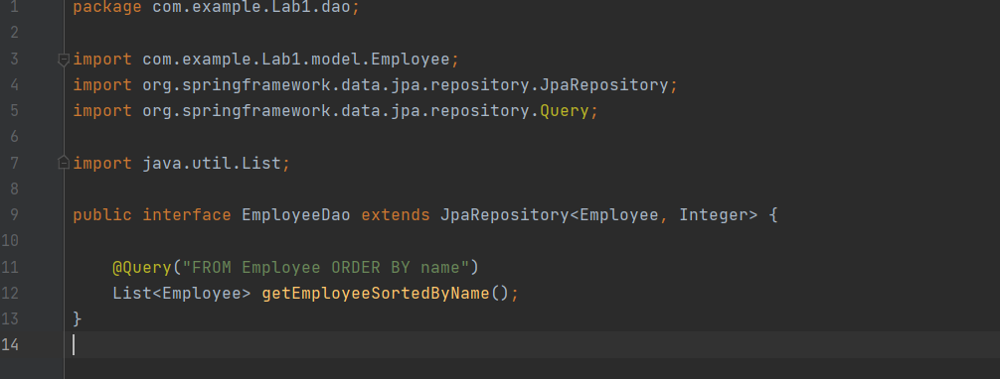
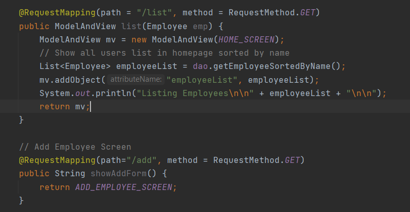
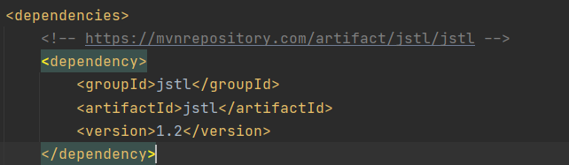
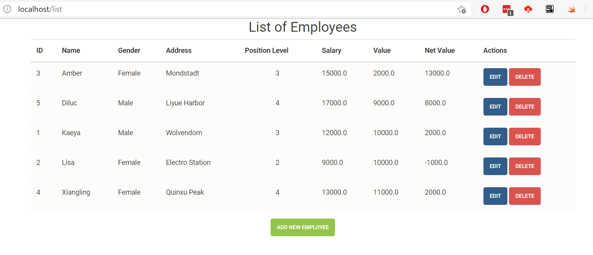
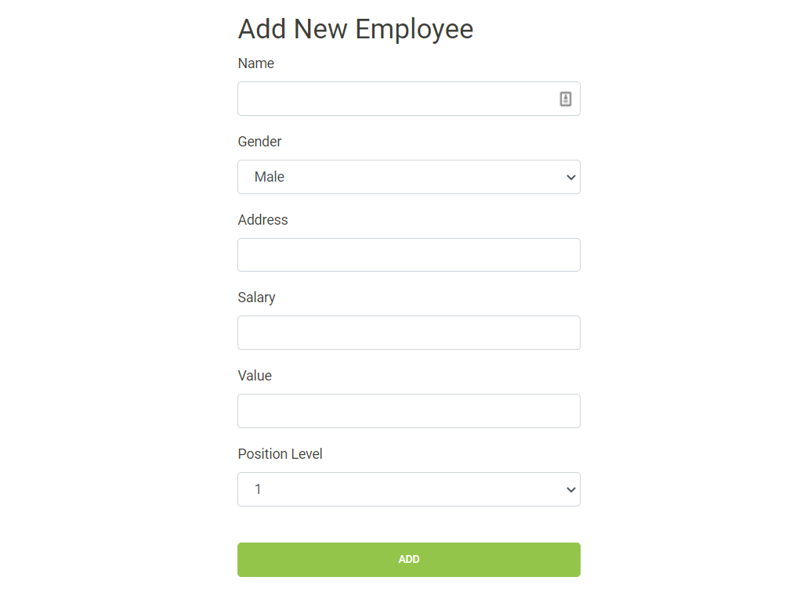
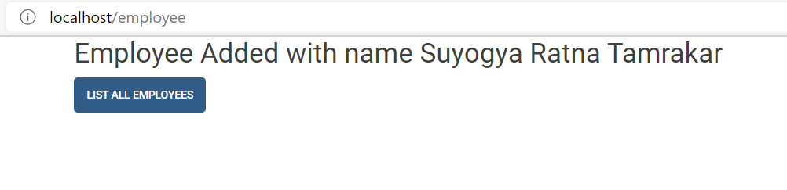
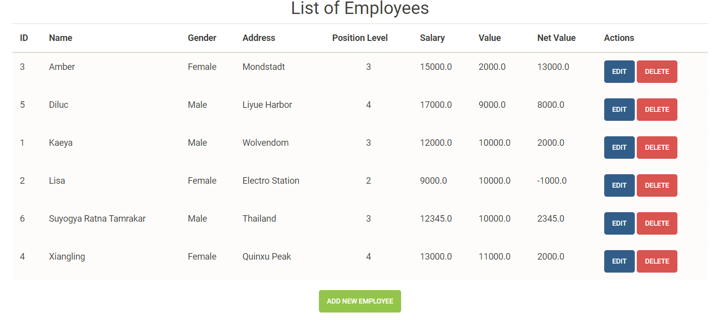
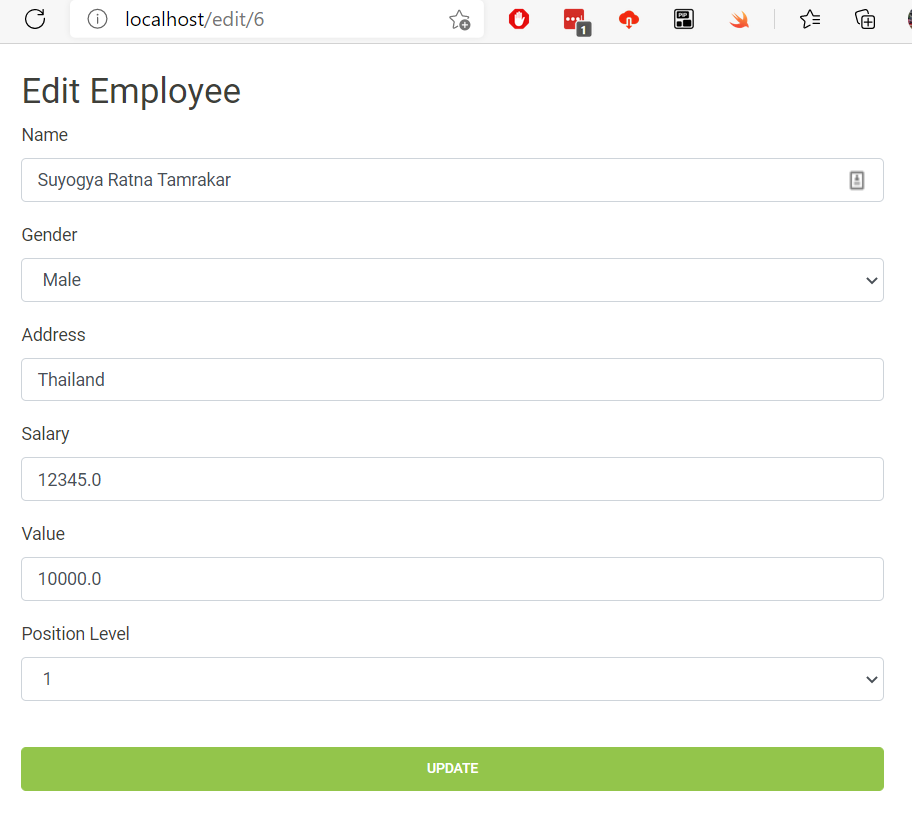

## LAB 1: RESTful APIs, MVC with Spring Boot

_**Objective:** To be able to implement basic CRUD operations on the database system using RESTful APIs in Spring Boot._

### Pre-requisites
1. Spring Boot installation
2. Postman for RESTful calls

### Dependencies Installed
The required dependencies can be downloaded from [MVN Repository](https://mvnrepository.com) website.
1. **Spring Web MVC** for web interfaces
2. **H2** for in-memory database
3. **Spring JPA** for common boilerplate SQL queries for Java
4. **Tomcat Jasper** to load and render JSP pages
5. **Jackson Dataformat** to allow our RESTful API to work with XML files
6. **Spring Dev Tools** for faster development
7. **JSTL** for using c-taglib directives in JSP

### Model Description

Here are the key concepts in Employee model to know about:

* `Employee` class is marked by `@Entity` annotation to make it recognized as a `TABLE` in the h2-database.

* `Gender` is declared as an `enum`. `@Enumerated` annotation is used to identify variable as `ENUM`. This enum stores `STRING` type data. Other type can be `ORDINAL` (numeric) in the order it is defined.

* `@Id` denotes that `eid` should be made the primary key in `Employee` table.
  
* `@GeneratedValue` means that employee id need not be provided manually, but is incremented automatically

* `@Transient` says that we don't need a separate column in database because it is an derived attribute, i.e. it can be calculated from the values already stored in the database.

_**Note:** We need to make sure that all the variable names declared inside the entity should have lowercased names. In my case, camelCase didn't work too._

### Static SQL Queries for initial configuration
`data.sql` file inside `resources` directory consists of database populating queries.

### Custom Query in DAO
We can create custom SQL queries in DAO using `@Query` annotation. Here, we are getting employee list sorted by employee names.

### Retrieving Lists and passing into JSPs

**Using *ModelAndView* class**
We can instantiate an object of `ModelAndView` class and add an object to it. We can specify in it's constructor regarding which view to return. This class allows to send data along with model data.

Here the list of employees is retrieved from the dao, and is passed into the html using Attribute name of "employeeList". In the JSP, we refer to its object using this name.

### Using c taglib to run JSTL codes

Add JSTL to the maven dependencies in `pom.xml` file and c taglib directive which consists of JSTL URI to the `<head>` tag of the html form where we need to use c-tags.

`<%@ taglib prefix="c" uri="http://java.sun.com/jsp/jstl/core" %>`.

Now we will be able to use c-tags and perform loop operations inside our html tags.

In this way, we retrieve the list we need using c-directives. We passed `employeeList` from the controller. 

### CRUD implementation
**Getting all employees in ascending order by Name**

Web apps homepage or `/list` page gets list of employees from the database and shows in the table format. Each records can be edited and deleted. New records can be added too by clicking `ADD NEW EMPLOYEE` button.

**Adding new employee**

We fill in the new employee details and then click on `ADD`, the form will send `POST` request and adds employee to the database

**Adding result**

Once added to the database, Add successful message is shown with option to retrieve all employees again.

**Updated list of employees**

An updated list is shown with the names still in ascending order.

**Edit and Delete employees**

When edit button is pressed, record that needs to be edited is taken to the edit page with the current values. We can then change the values and update by clicking `UPDATE`. `DELETE` button deletes the record.

`PUT` request is sent for Edit action and `DELETE` request is sent for Delete action.