## Lab 1: Guide on RESTful APIs, MVC with Spring Boot

_**Objective:** To be able to implement basic CRUD operations on the database system using RESTful APIs in Spring Boot._

### Pre-requisites
1. Spring Boot installation
2. Postman for RESTful calls

### Dependencies Required
The required dependencies can be downloaded from [MVN Repository](https://mvnrepository.com) website.
1. **Spring Web MVC** for web interfaces
2. **H2** for in-memory database
3. **Spring JPA** for common boilerplate SQL queries for Java
4. **Tomcat Jasper** to load and render JSP pages
5. **Jackson Dataformat** to allow our RESTful API to work with XML files

_**Note:** When adding dependencies, you may want to make sure on adding the dependency with the correct version. For example, if you are getting a dependency for Tomcat Jasper, then see the version of Tomcat-core in project libraries._

### Project Folder Structure
The files in the project are managed into different packages. We separate our project file into packages like controller, model, dao (Data Access Object).

### Important project files

**application.properties**
This is the configuration file for the project. If we have to configure some attributes of the database we are using, we do it in this file.

We can also change our server port in this file in case deault port 8080 is used by another application. Here I have changed by server port to be 80.

 We can access **h2 console** for our project, once the server starts running by going to this link in the web browser.

`localhost:[PORT_NUMBER]/h2-console`

_**Note:** Here JDBC URL needs to be exactly same as the one defined in `application.properties` file. However, at both places, the suffix can be changed to any name we like as it denotes name of our database, but other things in the URL must remain the same._

**User.java**
This is our model, and we annotate it with different annotations for it to be recognized as table by h2 database

`@Entity` for it to be recognized as a table in the h2 database
`@Id` annotation tells that it is the primary key for the table

Here we also implement neccessary getters and setters for our model.

_Note: All variable names should be lowercased to prevent conflict with the h2 database_

**data.sql**
This consists of SQL queries for initializing our in-memory database.

**JSP (Java Server Pages)**
These are the pages that we will use for rendering HTML content and views. Content could be forms, designs, user interfaces, etc, basically the front-end matters.

We need to connect the JSPs with the controllers and send and receive data to and from each other to make the web app functional.

**DAO (Data Access Object)**
These are interfaces that extend the data repositories. In this guide, we use two different kind of repositories.
1. **CrudRepository:** This repo returns Java object but Java objects may not be useful for all the applications. However, it does support all the basic SQL queries as well as custom queries using `@Query` annotation.
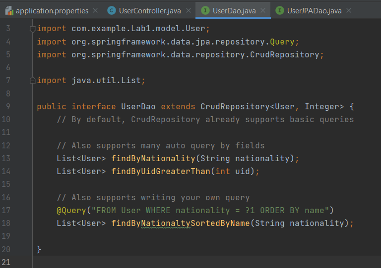
   
1. **JpaRepository:** This repo returns proper XML or JSON formatted response, which is quite well supported by many application interfaces. It uses Jackson Library to convert Java objects into XML or JSON formats.
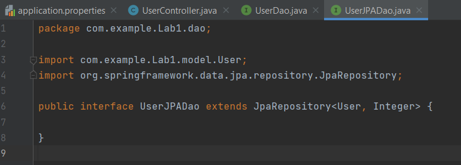

**UserController.java**
This file is responsible for mapping of defined model into different routes and pages. All the API endpoints about that model is defined here.

Namely, it consists of `@RequestMapping`, which accepts the endpoint, request method, and application-content. All the parameters, data-formats, headers, and other attributes required to make a successful API call is defined in this file.

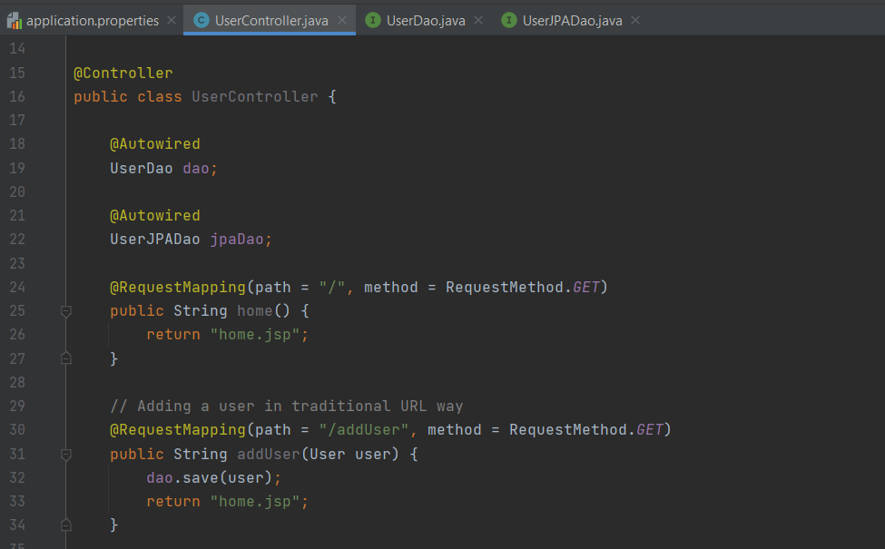

`@Controller` annotation tells that this class should be responsible in handling all RESTful calls related to that entity.

`@Autowired` on dao objects ensures that those classes are properly instantiated during the runtime. It is a dependency injection method that safely allows to access the data from just one instance in the controller.

`@RequestMapping` as the name suggests, maps the request on given path / endpoint, with appropriate request method, to the method inside the controller, where mapping of object and JSON objects are done very easily.

### Major CRUD Operations and Endpoints Verification using Postman
1. Open **h2-console** in web browser.
2. Open **Postman** and start creating and sending requests.

**Get all users using CrudRepository**
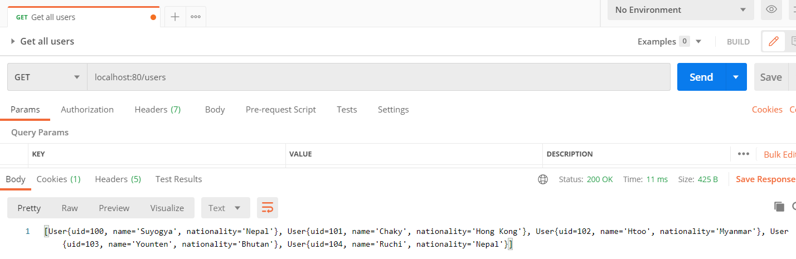
Notice how crud repository returns Java objects in its response.

**Get all users using JpaRepository**
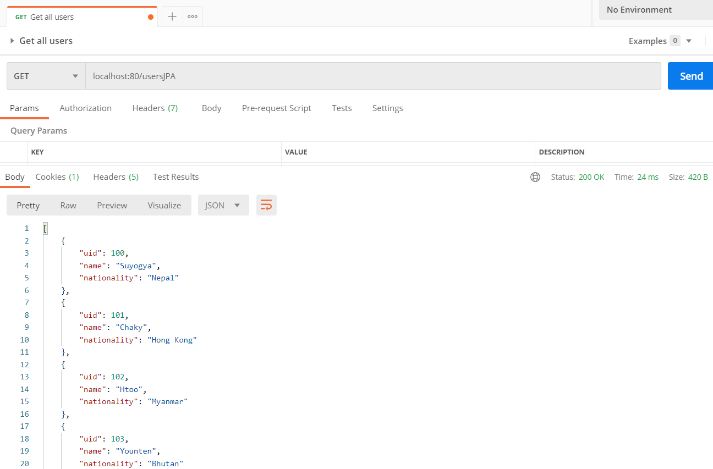
JPA repository returns well formatted JSON/XML objects.

---

**Get user by id using CrudRepository**
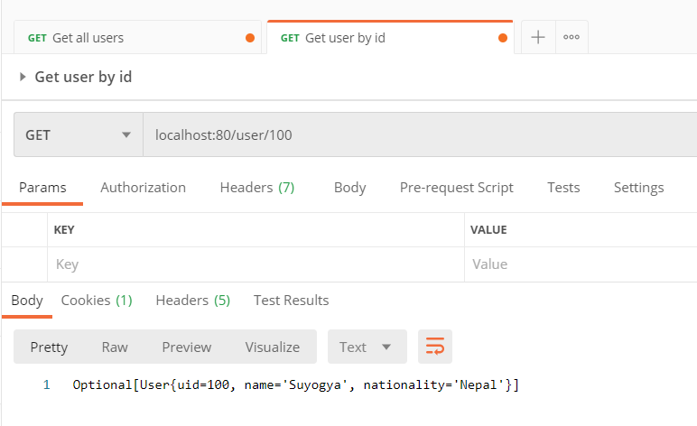

**Get user by id using JpaRepository**
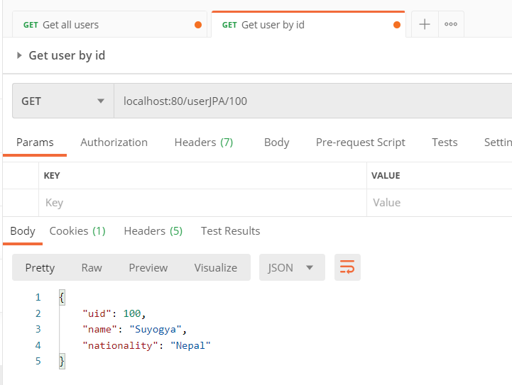

---

**Add new user**
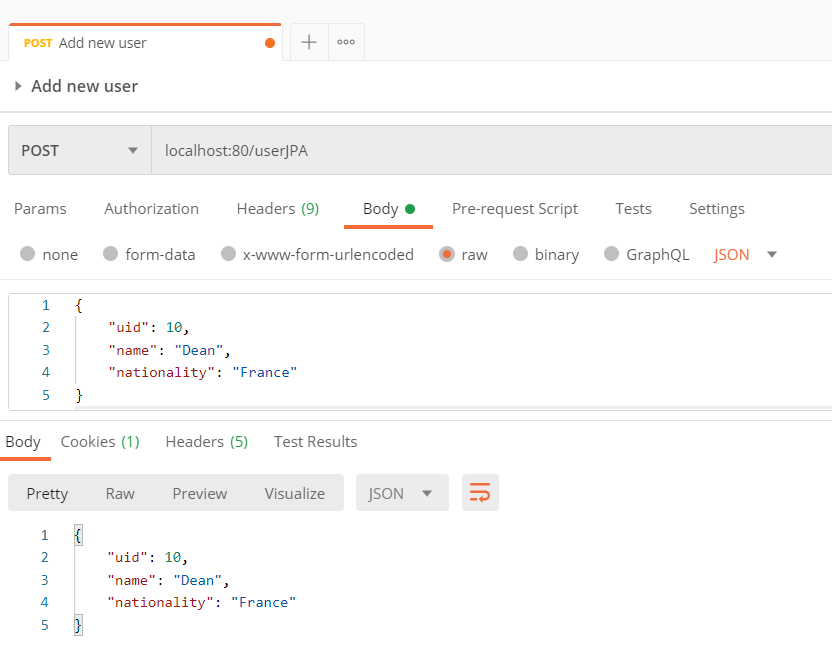
Here we do `POST` request on `/userJPA` endpoint with JSON object in the request body. The JPA repository maps this JSON object into respective model and saves it into the database.

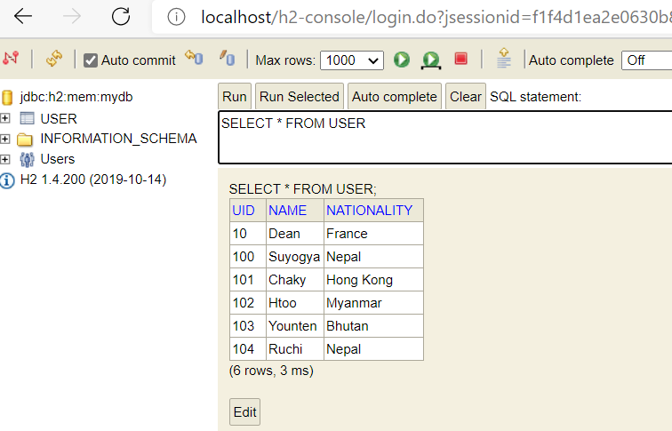

---

**Update user if exists, Create if does't exist**
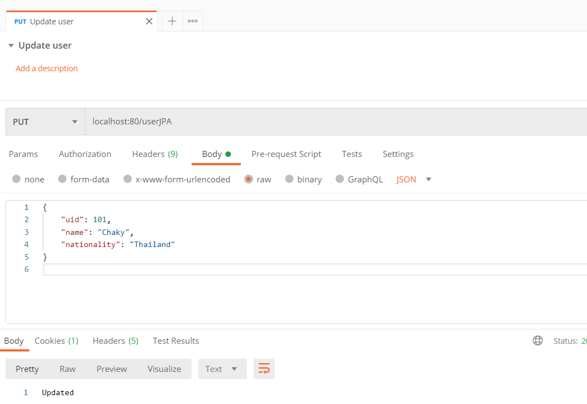
Here we do `PUT` request on `/userJPA` endpoint with JSON object in the request body. The JPA repository maps this JSON object into respective model and updates it if its Id value does exist already in the database, otherwise saves as a new record into the database.

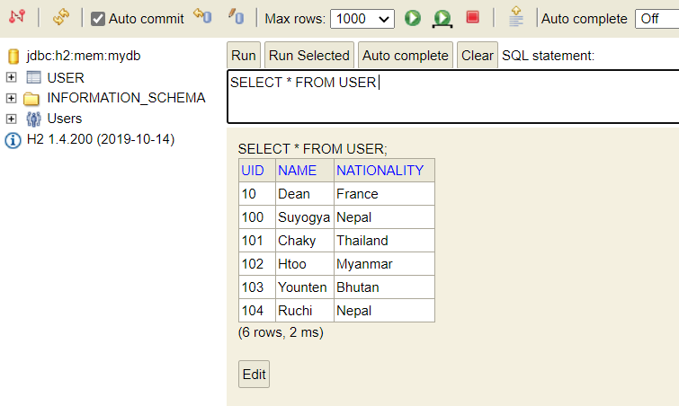

---

**Delete user**
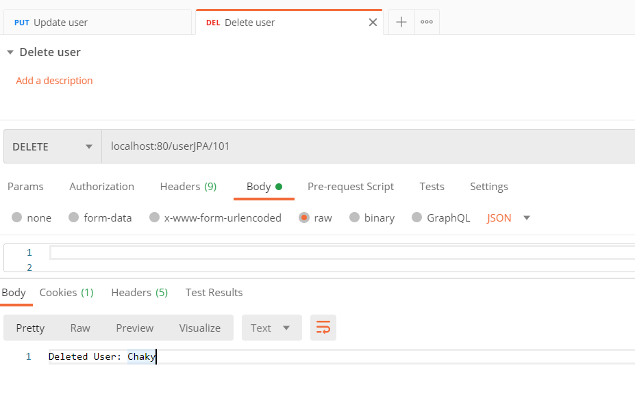
Here we perform `DELETE` request on `/userJPA/{uid}` endpoint where {uid} refers to the id of object to be deleted.

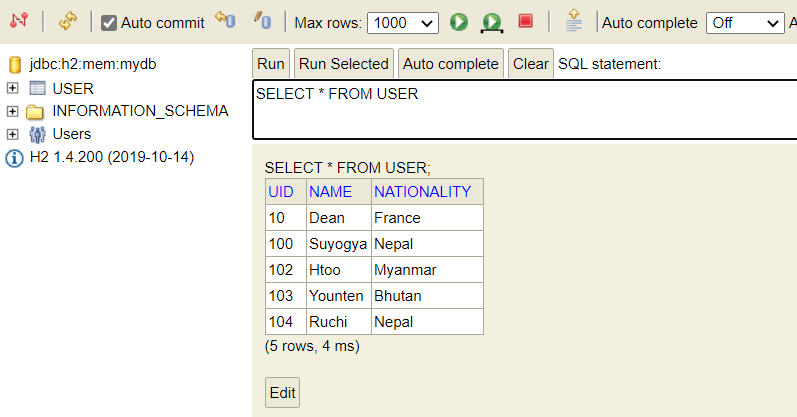

---

_**Note:** Notice how we can route all the requests related to one kind of entity using a single endpoint with change in request methods so easily with Repository interfaces in Spring Boot._