# LAB 2: Spring Security (Guide)

_**Objective:** To implement Spring Security classes to authenticate Users based on their roles in the system._

## App Pages and Forms
[Jump to App Screenshots](#app-screenshots)

## Required Dependencies
The required dependencies can be downloaded from [MVN Repository](https://mvnrepository.com) website.
1. **Spring Web MVC** for web interfaces
2. **H2** for in-memory database
3. **Spring JPA** for common boilerplate SQL queries for Java
4. **Tomcat Jasper** to load and render JSP pages
5. **Jackson Dataformat** to allow our RESTful API to work with XML files
6. **Spring Dev Tools** for faster development
7. **JSTL** for using c-taglib directives in JSP
8. **Lombok** for making things easier for getters and setters
9. **Java Mail Sender** for sending email
10. **Validation** for table validations
11. **Rest Repositories** for providing automatic restful controllers
12. **Spring Security** for built-in authentication and authorization

## Configure Proxy Mail in Mail Trap and add configurations
Create account in [MailTrap](www.mailtrap.io) and find the required SMTP credentials for testing email.

Put these in **application.properties**
```
##### Proxy Mail Server Config #####
spring.mail.host = smtp.mailtrap.io
spring.mail.port = 2525
spring.mail.username = <your username>
spring.mail.password = <your password>
```


## Create Models
In this project, main models are `User` and `Role`. These represent entities and become tables in the database.
   
### User Model
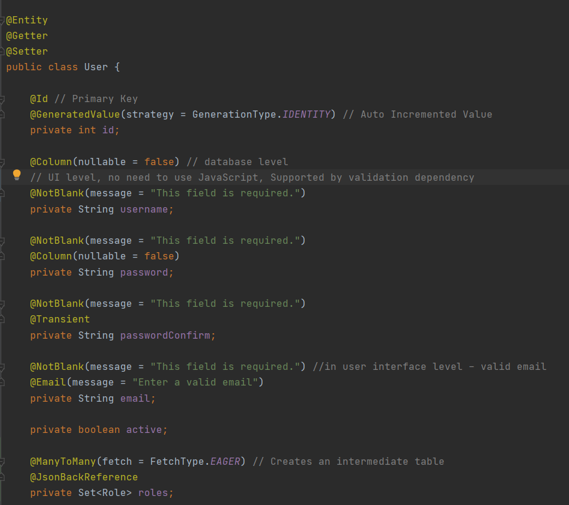

`@Entity`: Represents a table in the database

`@Id`: Determines primary key.

`@GeneratedValue`: Tells JPA that primary key is auto increment.

`@Column`: Represents column of table. We can set custom name for column too.

`@Getter` and `@Setter`: Lombok annotations for auto implementation of getters and setters

`@NotBlank`: Supported by _validation_ dependency that operates in UI level to detect blank entries. No need of JavaScript.

`@Transient`: Tells JPA not to create column, only used to handle internal logic

`@Email`: Supported by _validation_ dependency for validating email

`@ManyToMany`: Creates an intermediate table. `FetchType.EAGER` ensures that so that when users are created, it will also fetch roles.

`@JsonBackReference`: Specifies the child of the bi-drectional relationship

### Role Model
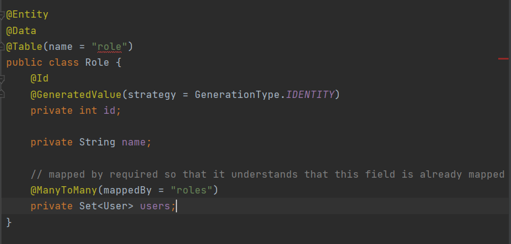

`@ManyToMany(mappedBy = "roles"`: Tells JPA that it is already mapped in User Model. It prevents
from getting duplicate tables.

`@Data`: Provides codes for getters, setters and toString.

## Create DAOs
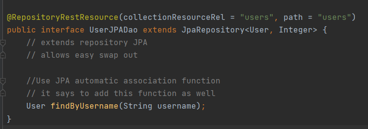
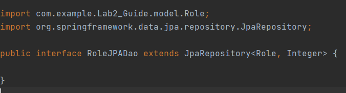

DAO (Data Access Object) is created for retrieveing the data from the database of
the entities we have. We will use this data access layer from `Service` layer.


## Insert Default Roles
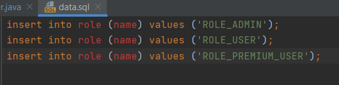

Create `data.sql` file inside Resources and write SQL Queries to insert 
Roles in to Role table.

_**Note:** Spring Security expects prefix `ROLE_` for any role name you provide._

## Some Compoenents in Spring
```
@Controller -> Singleton
@Component -> Singleton
@Service -> Singleton
@Entity -> Not Singleton

What is @Service? How is it different from @Component or @Controller?

@Component -> Autowired
@Controller -> @Component + some additional capabilities
@Sevice -> @Component + some service capabilities
```

## Important Points to remember
* **Controllers** are reponsible to handle request mappings and views.
* **Services** are responsible to handle internal logic. Services can call other services. One service for one entity.
* **DAOs** are responsible to communicate with the database and do data operations.
* **Services use DAOs** to handle backend data.
* **Controllers only use Services** to handle database operations.
* **Services** are generally interfaces that declare methods only.
* **Service Implementors** are concrete classes that implement the service and handle business logic.

## Email Service Implementation
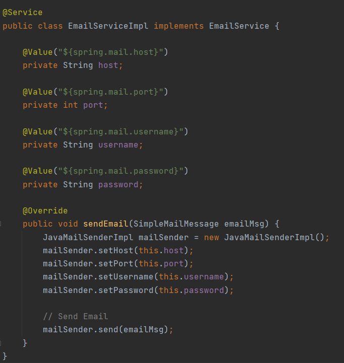

`@Value`: Binds the variable to the value in **application.properties**

This Service class implements **EmailService** interface and performs mail sending feature using **Java Mail Sender**.

## User Service Implementation
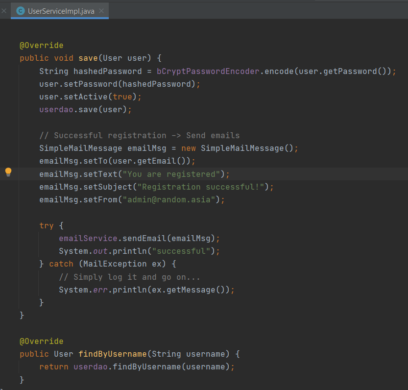

This Service class is responsible to perform logical operations of **User** class.

It acceses **UserJPADao**, **BCryptPasswordEncoder**, **EmailService** to do internal logic.

**save** method operates in following way:
* Updates encoded password for user
* Creates **SimpleMailMessage** object with email contents
* Calls method from **EmailService** to send mail.

**findByUsername** method simply accesses **UserJPADao** to communicate with the database.

## User Details Implementation (Built-In)
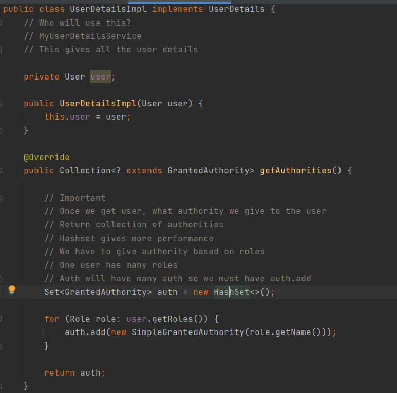
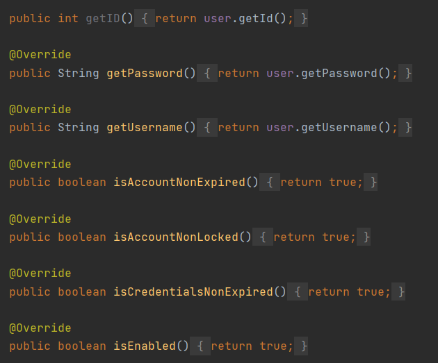

This class implements **UserDetails** which is the built-in class that provides authority grants to users.

Here, we add roles of the logged in user as a granted authority.

Also we set several values for the authorized user.

## User Details Service Implementation (Built-In)
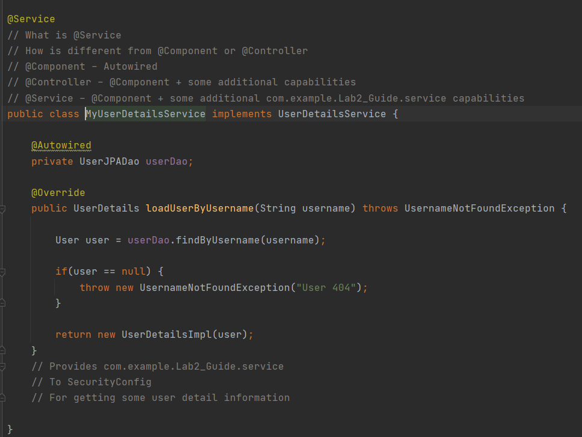

This Service class implements **UserDetails** interface, and it is a concrete implementation
of how users will be created with authorities and will return **UserDetails** object for the user.

## Spring Security Config Class Implementation
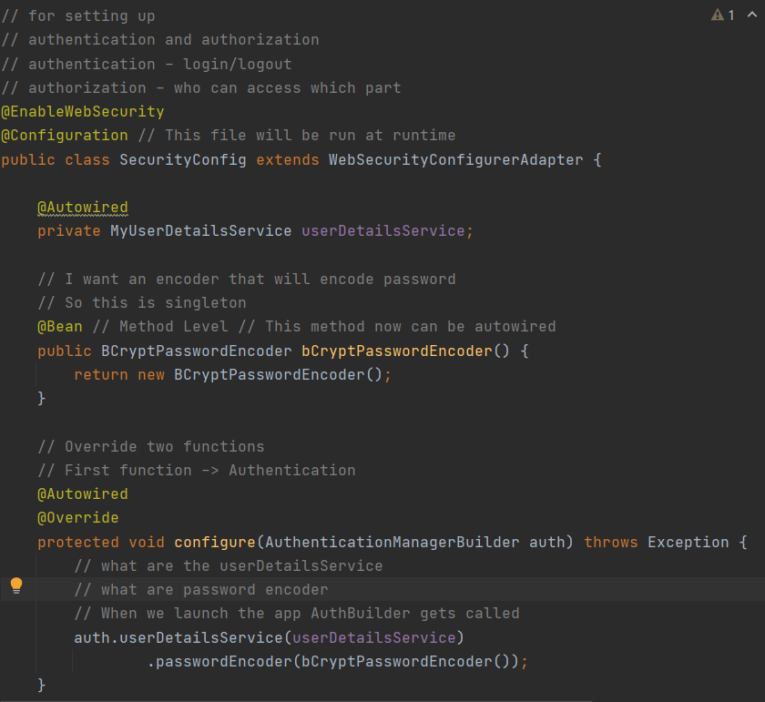

Here, this file controls authentication and authorization logic, and password encoders

We use **BCryptPasswordEncoder** as a **Bean**. Adding as a bean allows other classes to use it and **Autowired** it.

The overrided configure method uses these beans to add authentication for the users.

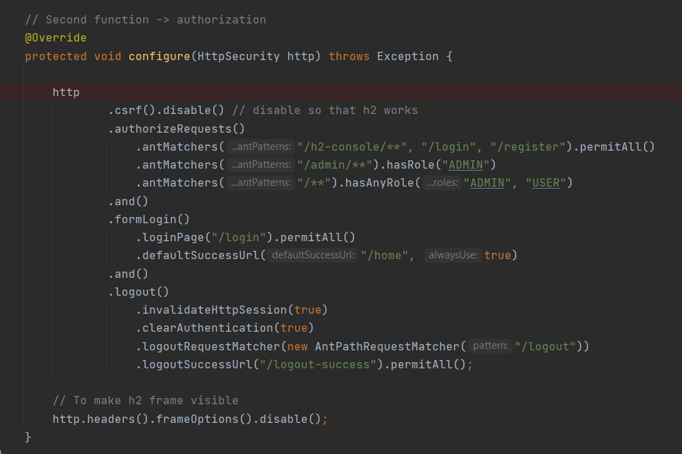

Another overrided configure method is for handling **HttpSecurity**.

It gives permission to the web paths and URLs based on roles of users, adds authentication
on specific paths, or give access to any paths.

We also add **formLogin** method to handle our custom login page and is succeeded with a **defaultSuccessUrl** which redirects to that page
on successful login.

**logout** method is responsible to invalidate active sessions, clearing authentication, and determining which page to land
on successful logout.

## User Validator Implementation
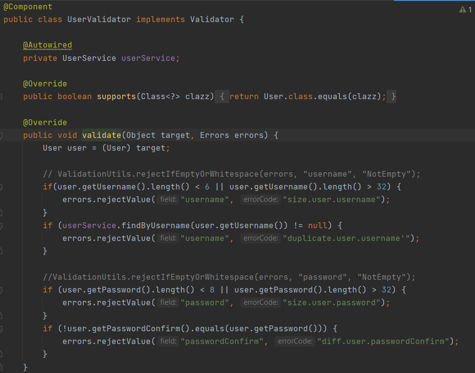

This class implements `Validator` interface which provides functions to store **errors** as a result of **validation rules**.

`@Component`: Makes the class singleton and allows it to be **Autowired** in other classes.

## User Controller
Controller class handles the **http requests**, and shows appropriate **views**.

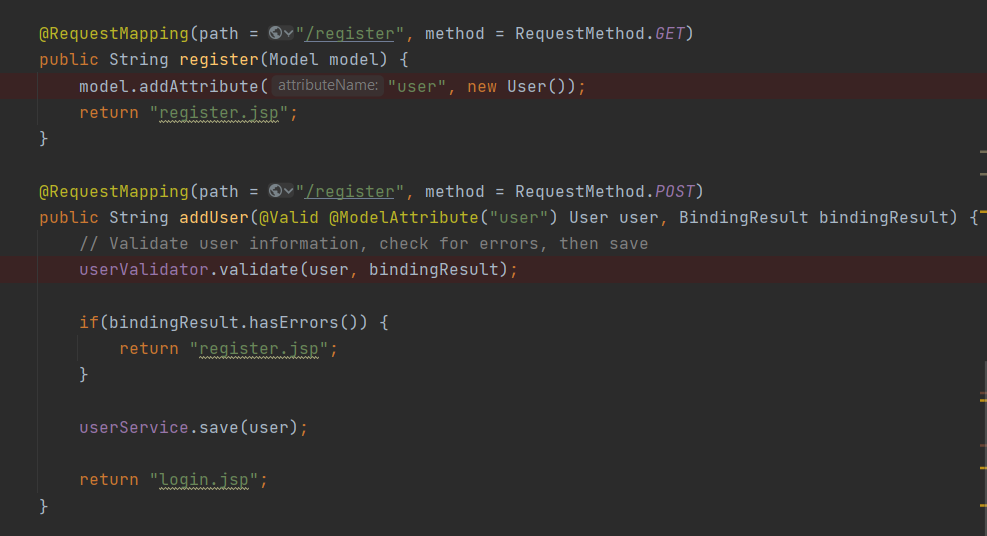
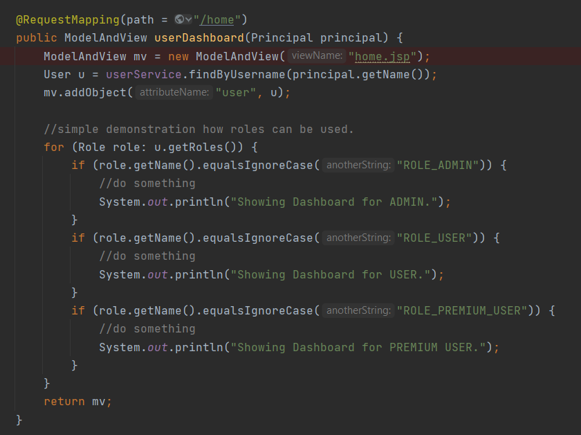

`@Valid`: Tells Spring Boot to apply validator to the attribute

`Model model`: Similar to **ModelAndView**, allows to add **ModelAttribute** to pass into views.

`@ModelAttribute`: Specifies certain attribute belongs to a model.

`Principal`: Retrieves which user is currently logged in, in the current active session.

`BindingResult`: This object holds errors after being validated.

>**Note:** BindingResult parameter always comes after **@Valid** attribute. Means the order of parameters matter here.

## Spring Form Bindings and JSTL
```
<%@ taglib prefix="spring" uri="http://www.springframework.org/tags" %>
<%@ taglib prefix="form" uri="http://www.springframework.org/tags/form" %>
```
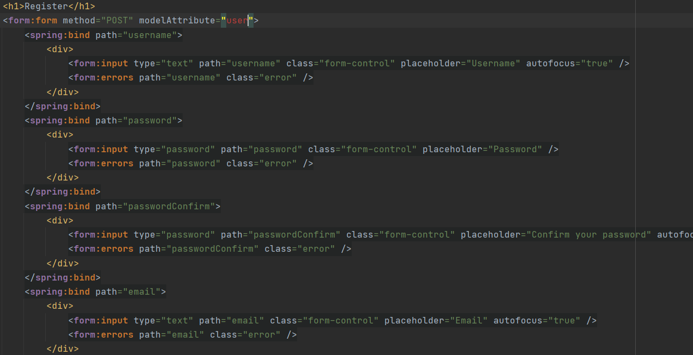

`spring` and `form` taglibs are used for **form bindings**. We also get the variable passed from controller class as a **modelAttribute**.


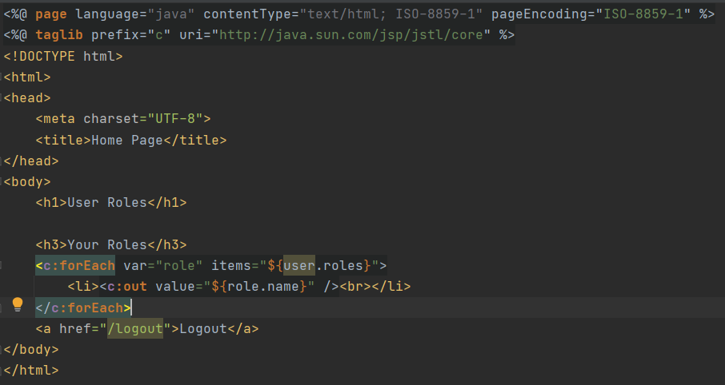

We use `c` taglibs to run JSTL in our views. JSTL allows us to handle logics inside our views.

## App Screenshots
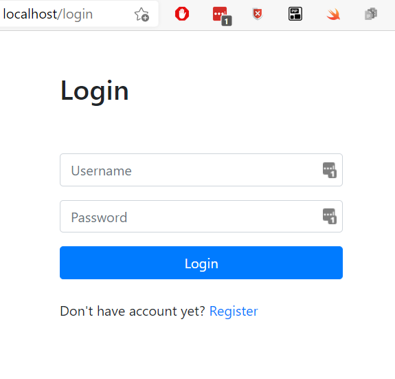
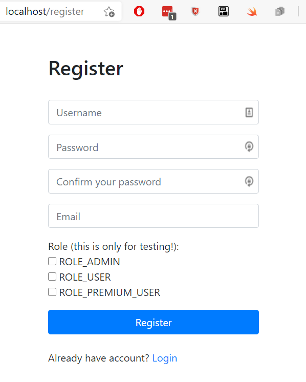
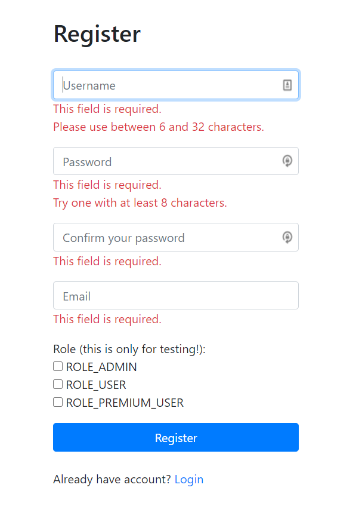
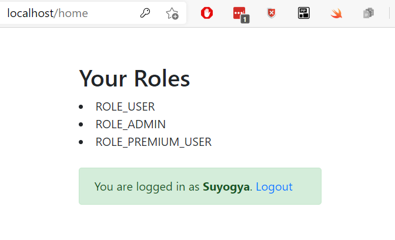
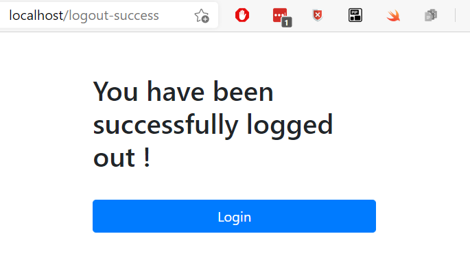
