# Take Home Tasks

### a. Changing cache time
> Set the employee cache to 20 seconds, 
> and run the test again. Look at testCache.
> What happens? Document your findings.

**Answer:**

_**What was happening BEFORE when `timeToIdleSeconds="5"`?**_
* First, `testFetch()` gets employee, so it hits SQL Query.
  

* Then, on calling `testCache()`, it loaded from cache, as `5 SECONDS` was still not passed.
* Then it `SLEPT for 10 SECONDS`.
  

* By this time, idle time has passed and no request is made, so the `CACHE INVALIDATES`.
  

* So, when it runs `testCache()`, the SQL Query is made again, and the `IDLE TIME is RESET to 5 SECONDS`.
  

* On next several calls of `testCache()`, it is still under 5 seconds time frame. So employee is loaded from the cache.
  

* It again sleeps for 10 seconds, when the idle time again passes. So SQL Query is made again.


I changed `timeToIdleSeconds = 20` and `timeToLiveSeconds = 100`. 
```xml
    <cache name="employee"
           maxEntriesLocalHeap="10000"
           eternal="false"
           timeToIdleSeconds="20"
           timeToLiveSeconds="100">
        <persistence strategy="localTempSwap" />
    </cache>
```

_**What is happening here?**_
* First, Employee is loaded by `testFetch()` method, so it makes SQL Query.
    * Now the employee is added to the cache.
    * The `20 SECONDS IDLE` countdown has begun.
    

* Then, `testCache()` method is called.
    * Here, Employee is loaded from the cache.
    

* Now, code `SLEEP FOR 10 SECONDS`
    * After this 10 seconds, we still have employee in the cache.
    * The remaining time will be more or less 10 seconds.
    

* Again, `testCache()` method is called several times.
    * Still, the cache is not yet invalidated, employee is still there.
    * At this point, `IDLE TIME` will reset to `20 SECONDS` again.
    * Countdown again begins from `20 SECONDS`.
    

* Now again, code `SLEEP FOR 10 SECONDS`
    * The remaining time will still be like 10 seconds more or less, 
      as idle time has been reset after being called.
    

* So, when `testCache()` is called again
    * Employee is still in the cache, so loads from cache without making SQL Query.

_**Console output after setting Employee cache to 20 seconds**_

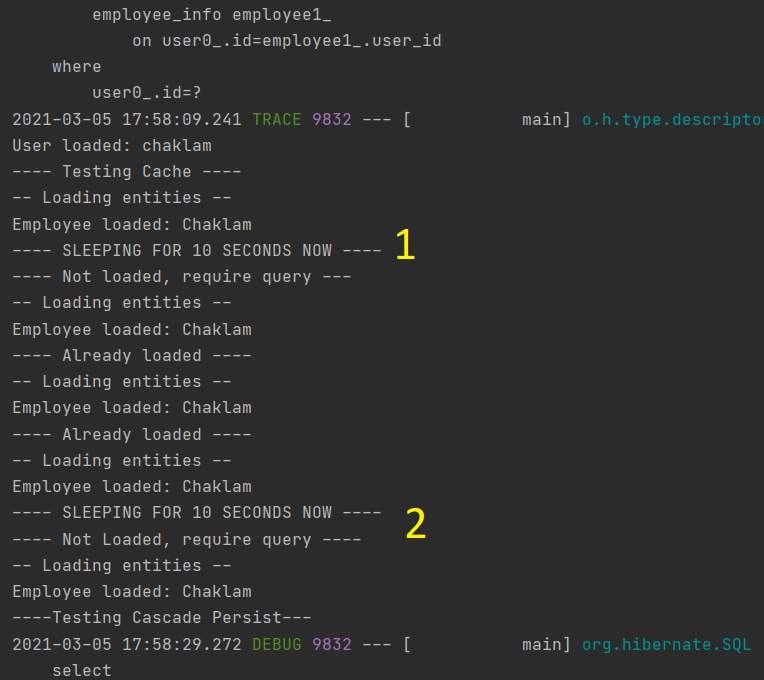


### b. Make foreign key of Employee in User Table
> Attempt to change the code, so that User table has 
> the foreign key of Employee.

**Answer:**

**Employee BEFORE has `USER_ID` as foreign key**

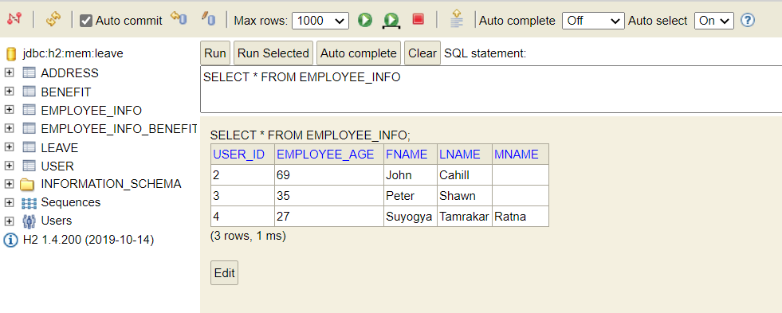

**User BEFORE**

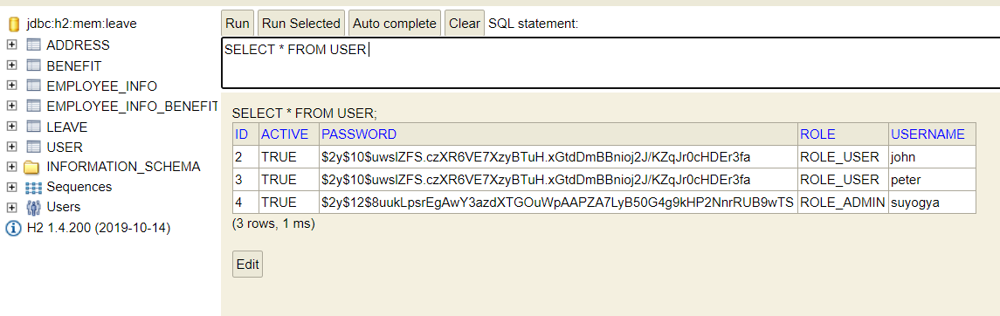

After changing the code.

**User NOW has `EMP_ID` as foreign key**

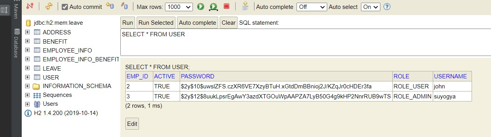

**Employee NOW**

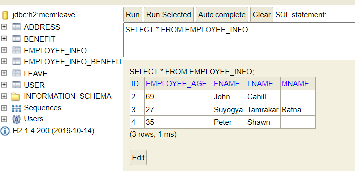


### c. `Cascade.REMOVE` vs `orphanRemoval = true`
> Research and discuss the difference between cascade.REMOVE and orphanRemoval=true 
> (use your own words)

**Answer:**

#### CascadeType.REMOVE
This property deletes the child entities when its parent is deleted.
For e.g. In our coding assignment, we have `Addresses` related with the `employee` with `@ManyToOne` relation.
So what will happen to the addresses belonging to that employee when we delete that employee?
Will they be available or will they be deleted too?

On removal of the employee entity from the database, setting to **CascadeType.REMOVE** will also remove all the
`Addresses` associated with that employee.

It happens in such a way that, when parent entity is deleted, all its associated child elements are deleted too.


#### orphanRemoval = true
This property will delete alone entities from the database. Alone entities means those entities who still has some foreign key
of some entities that is already deleted. Such entities are called orphaned entities. 

Even though is cascade operation was not performed, and with deletion of parent entity, their associated child still remains,
setting `orphanRemoval=true` will ensure that all the child entities having reference to already-deleted entities are removed as well.

There is basically no need to store child entities without having their parent entities.

### d. Remove `FetchType.Lazy` and test
> Remove lazy load from addresses and benefits, run the testFetch function. 
> What happens? Document your findings.

**Answer:**

**Addresses** and **Benefits** have one-to-many and many-to-many relation with the employee entity respectively.

_**When `FetchType.Lazy` was set, these were the steps happening under the hood**_

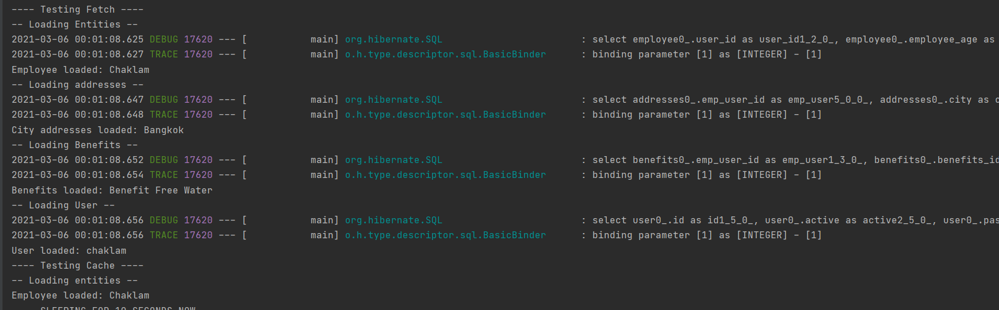

* ` employee.getName().getFname()` method was called.
  * Then, SQL query hit for Employee
  * Other entities not queried yet.
  

* `employee.getAddresses().iterator().next().getId().getCity()` method was called.
  * Then, SQL query hit for Address
  * Benefit and User is not queried yet.
  

* `employee.getBenefits().iterator().next().getTitle()` method was called.
  * Then, SQL query was run for Benefit.
  * User is still not queried.
  

* `employee.getUser().getUsername()` method was called.
  * Now, user is queried.

_**Now we remove `FetchType.Lazy` from Addresses and Benefits**_
* We run the application again, still the behavior is same as keeping `LAZY`.
* It is because, by default, properties annotated with `@OneToMany` relation have `FetchType.LAZY`.

_**Now we put `FetchType.EAGER` in Addresses and Benefits**_

Now we can see the change.

* Once we get the Employee, all child entities associated with it are also queried together.
* That means, with just single call for employee entity, all its descendents are also retrieved in a single call.
* We can observe below, no SQL query was run for `Address` and `Benefit`.
* However, we can see the SQL queried for `User` entity, as it still has `LAZY` fetch type.

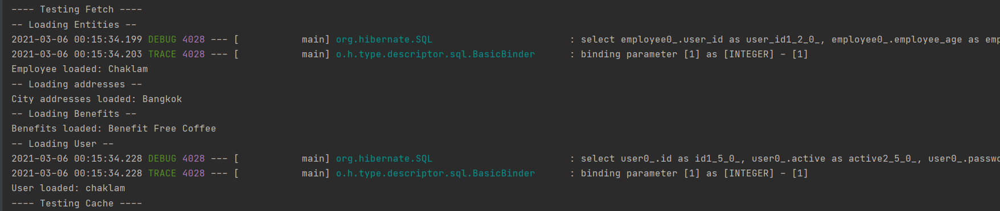

### e. Run `testCascadeRemove` and `testCascadePersist` after removing some properties
> Remove cascade = cascadeType.ALL and orphanRemoval = true from benefits and addresses, 
> run the testCascadeRemove and testCascadePersist function. What happens?  
> Document your findings.

**Answer:**

_**What was happening BEFORE with `CascadeType.ALL` and `orphanRemoval=true`**_

* When `testCascadePersist()` method was called these were happening in sequence.
  * SELECT all tables
  * INSERT employee_info
  * INSERT addresses
  * INSERT benefits
  * INSERT employee_info_benefits (intermediate table)
  

* When `testCascadeRemove()` method was called these were happening in sequence.
  * SELECT Leaves (there were no leaves initially)
  * SELECT user
  * DELETE from employee_info_benefits (intermediate table)
  * DELETE from address
  * DELETE from employee_info
  * DELETE from user
  
_**Now we remove `CascadeType.ALL` and `orphanRemoval=true` from Addresses and Benefits**_

By default hibernate does not apply any cascade types. With these properties removed from **address**
and **benefit**, when employee gets deleted, the change is not cascaded to the child entities. That means 
address table would still have the row related to the deleted employee.

As employee and benefits are related by many-to-many relation, they have the intermediate table. So, deleting employee
will not delete associated child entries in the benefit table.


### f. Remove `@Transactional`
> Attempt to remove **@Transactional** from any of the methods defined 
> in the TestService.java. There are some errors. Explain why such an error happens.

**Answer:**

First, I tried removing `@Transactional` from `testCascadePersist()` method.
This action threw exception called `TransactionRequiredException`:

```text
Exception in thread "main" javax.persistence.TransactionRequiredException: 
No EntityManager with actual transaction available for current thread - 
cannot reliably process 'persist' call
```

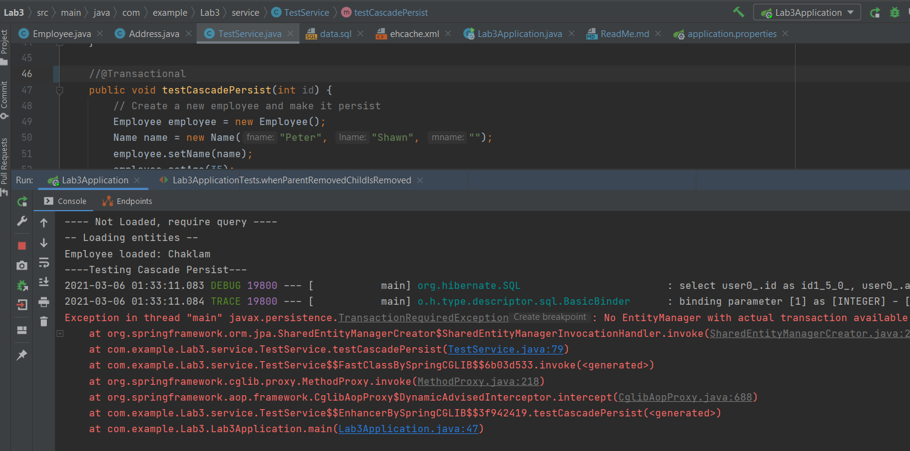

It is probably due to the cross-relationships between employee with address, benefit, and users. That is,
when we try to set addresses, benefits, users to the newly created Employee, those are the actual transactions
made into the database. So without `@Transactional` annotation, they cannot be committed properly.

Second, I tried removing `@Transactional` annotation from `testFetch()` method.
This action threw another exception called `LazyInitializationException` worth discussing:

```text
Exception in thread "main" org.hibernate.LazyInitializationException: 
failed to lazily initialize a collection of role: 
com.example.Lab3.model.Employee.addresses, could not initialize proxy - no Session
```

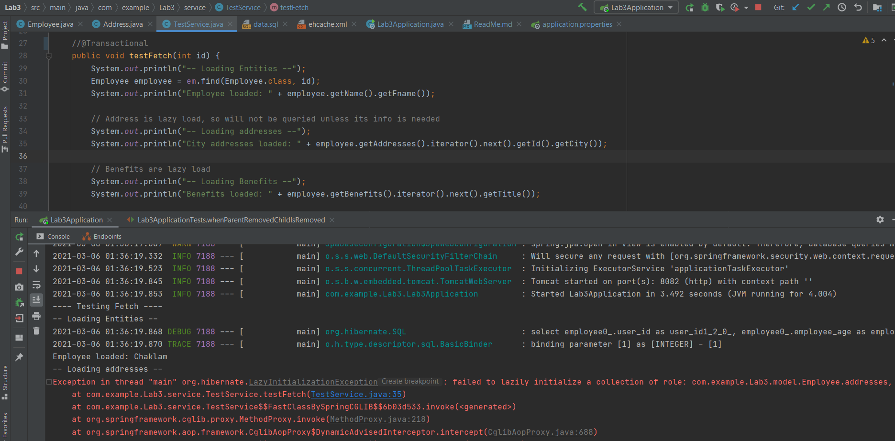

The addresses, benefits and user in employee entity are fetched lazily. So when we remove `@Transactional` annotation
from the method, we get exception because it fails to initialize the lazy loaded properties.

Third, I tried removing `@Transactional` annotation in other methods too.

It threw `TransactionRequiredException` in case when we try to **persist**, **remove** or **create** entities.

### g. Write `JUnit tests`
> **Coding**: Transform my main program test into unit test.
**Answer:**

#### Test Fetch
Here, I added certain `Assertions` to verify the state of entities throughout the program.

_**Assertions.assertEquals(expected, actual)**_
* This method tests if the actual value equals to the expected value.
* Here, I checked employee's name with id 1, to be "Chaklam", by accessing its `getName().getFname()` methods.

_**Assertions.assertFalse(condition)**_
* This method tests if the condition provided is false.
* Here, I checked whether or not the property whose fetch type is LAZY, is initialized before it gets accessed or not.
* Also, I checked after knowing for sure that it is already initialized by using `assertTrue` method.
* The initialization state is tested by using the method `Hibernate.isInitialized()`


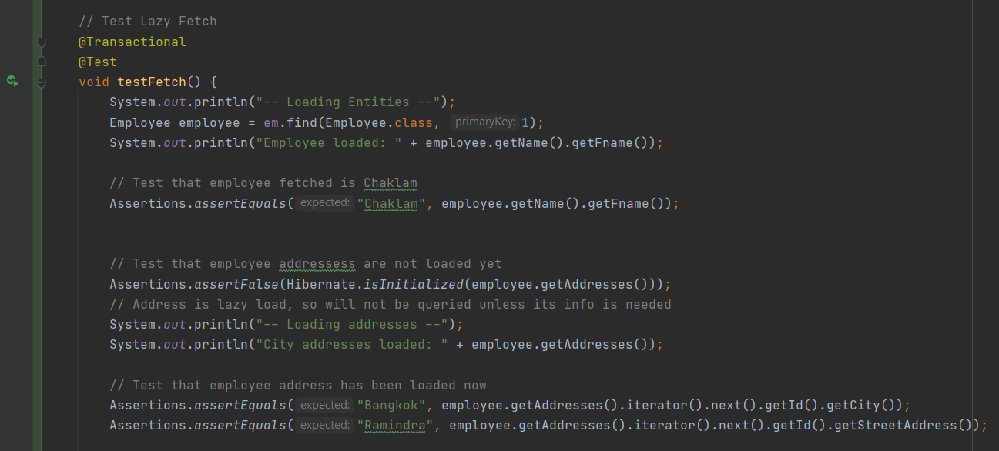

If we do not add `@Transactional` annotation, then it will throw `LazyInitializationException`.

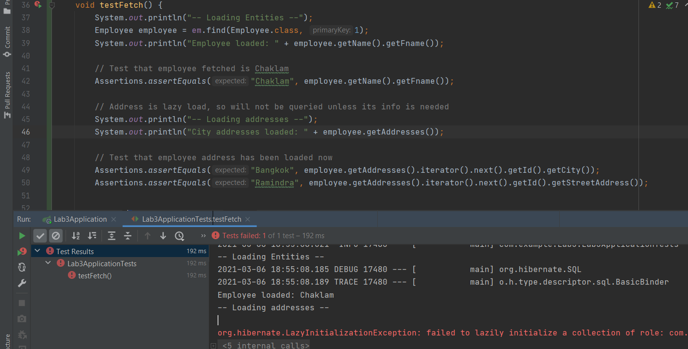

#### Test Cache

Here, I referenced our `ehcache.xml` file to get instance of a cache manager with cache name `employee`. 

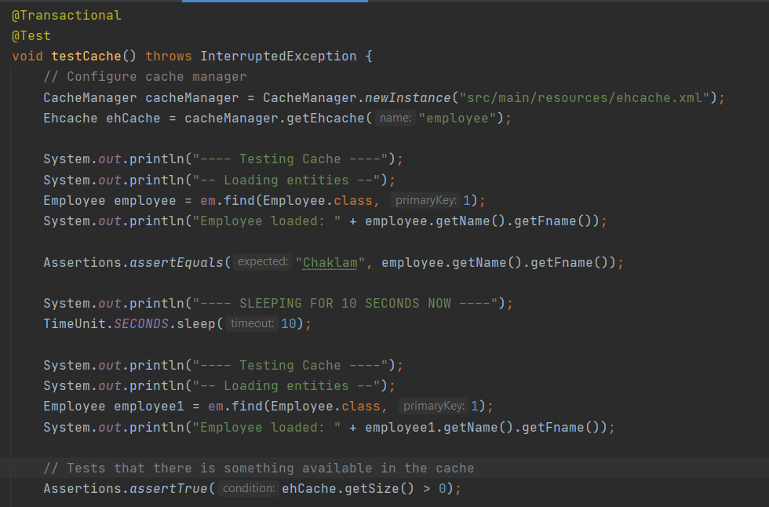

Then, `assertTrue` method tests if the size of cache is still greater than 0, after 
sleeping for 10 seconds.

[Useful Resource on Ehcache](https://www.baeldung.com/ehcache)

#### Test Cascade Persist
Here, I checked `assertNull` method to see if the `Employee` entity with id 3 is null at first.

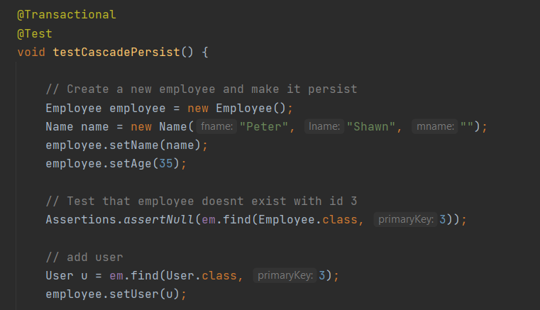

Then, the employee object is persisted in the persistence context. Few more assertions are made:
* `assertNotNull` to test that the entity persisted.
* `assertEquals(name, name)` to test that the employee that persisted has the first name "Peter".
* `assertEquals(id, id)` to test that the id of the persisted employee matches with the user id of the same employee.
Passing this test also means the success of `@OneToOne`relation with `@MapsId` annotation.

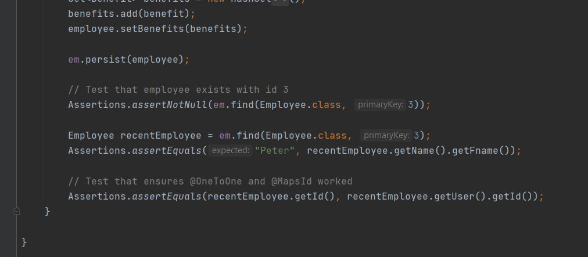

#### Test Cascade Remove

Here, I loaded Employee entity with id 1 and asserted that it is correct. Also I asserted that employee's
addresses and benefits to see if they are currently persisted. I tested using `assertNotNull` to find the benefit
associated with this employee.

Then the employee was removed.

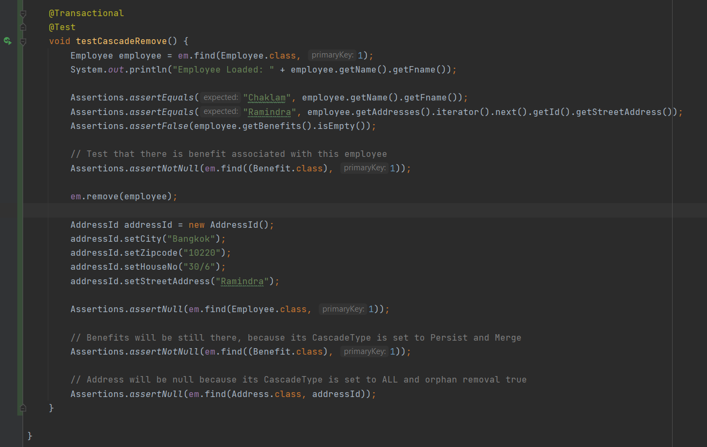

`assertNull(Employee)` method ensured that the employee was successfully deleted from the persistence context.

`assertNull(Address)` method ensured that the address with composite key, i.e. `@EmbeddedId` addressId, was used to see whether we can
find that the associated address was also removed. And yes it is because, for employee addresses,
the CascadeType was set to ALL with orphanRemoval true.

`assertNotNull(Benefit)` method ensured that even though employee was deleted, benefits associated with the employee still remains,
because for employee benefits, the CascadeType was set to persist and merge. That is why benefits was not null.

#### Running Tests

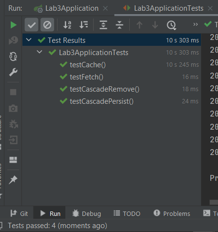

### h. Extend app to apply leave and approve leave
> **Coding**: Attempt to extend the app so that user can apply sick leave or annual leave 
> (do not make any fancy thing, simply add leave), and admin can approve leave.

**Answer:**
#### User Sign In

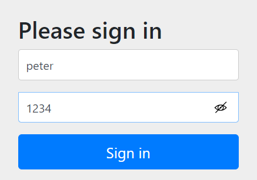

#### User can apply for leave and view his leave statuses

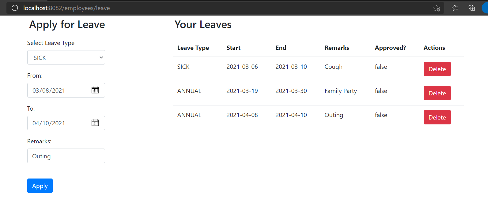

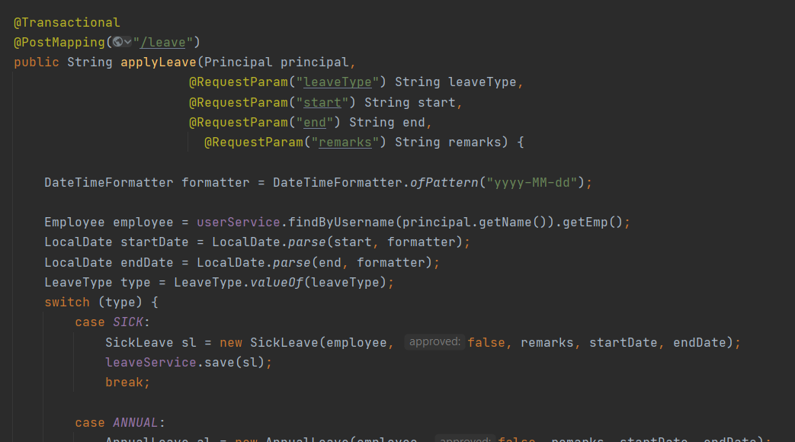

#### Admin Sign In

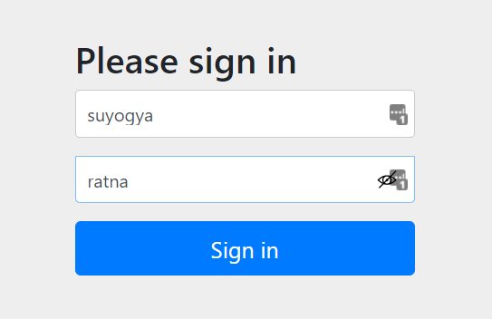

#### Admin can see available UNAPPROVED leave requests

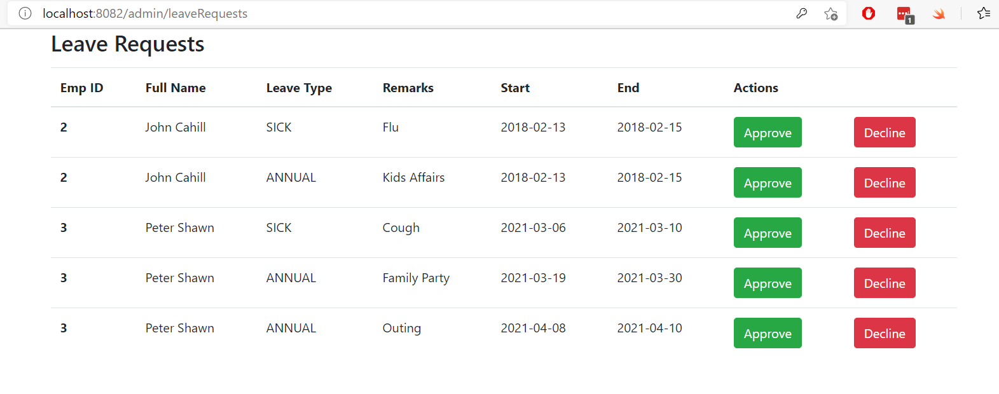

Traversing through list with nested entities.

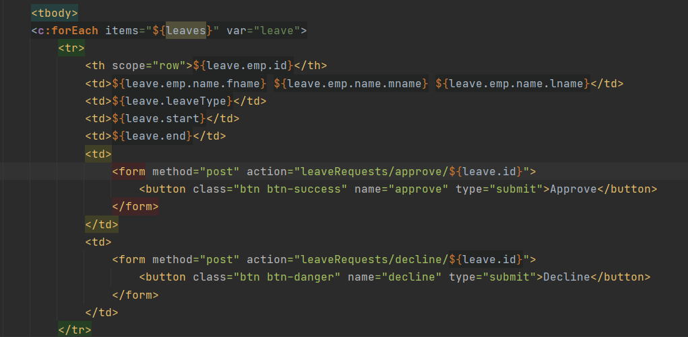

With `@Transactional` annotation, we do not have to `Save` the leave. We can simply set it's property.

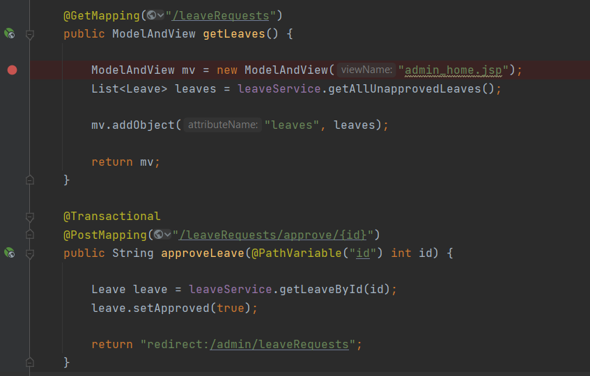

#### After admin approves a leave, Approved status changed to true

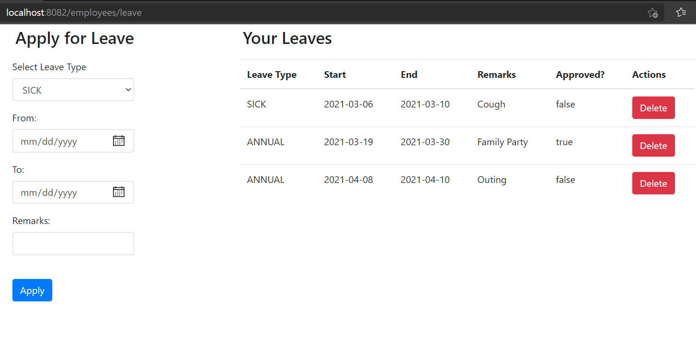