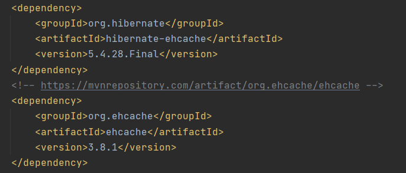
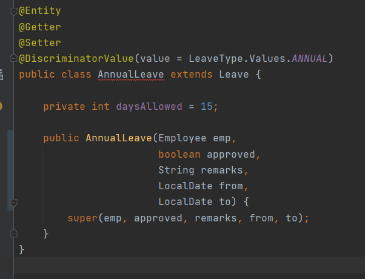

# Lab 3: ORM, Hibernate, JPA, and Spring

## Contents
[Caching (Hibernate's second-level cache)](#caching)

[Useful Resources on Caching](https://www.baeldung.com/hibernate-second-level-cache)

[(ORM) Object Relational Mapping]()

## Dependencies
## General Dependencies
1. **Spring Web MVC** for web interfaces.
2. **H2** for in-memory database.
3. **Tomcat Jasper** to load and render JSP pages.
4. **Jackson Dataformat** to allow our RESTful API to work with XML files.
5. **JSTL** for using c-taglib directives in JSP
6. **Lombok** for making things easier for getters and setters
7. **Spring Security** for adding user management.
8. **JPA** for in-built persistence classes.

## Additional Dependencies for Cache
### hibernate-ehcache
* Install same version as hibernate-core
### ehcache
* Gives 2nd level caching
* 1st level caching we don't have to do anything, springboot handles it by default.
* 1st level caching will not persist across sessions/transactions.
### Difference
**hibernate-ehcache** is just an interface that allows ehcache to work properly.

## Caching
When we load some entities and objects frequently, we will not load them twice after its loaded already.
Doing this creates performance issues. We have to cache.

ORM (Object relational mapping) frameworks has ability to transparently cache data retrieved from
the underlying data stores. 

* This help in eliminating database-access costs for frequently accessed data.
* Performance can be gained if read/write ratio of cached content are high, especially
for entities which consist of large object graphs.
  
### First-Level Cache
Hibernate has the concept of first-level cache.
* It is a session scoped cache which ensures that each entity instance is loaded only once
in the persistence context.
  
* Once the session is closed, first-level cache is terminated as well.

* This is desirable, as it allows concurrent sessions to work with entity instances in isolation
from each other.

### Second-Level Cache
* It is SessionFactory-scoped. It is shared by all sessions created with the same session factory.

When an entity is looked up by its id (either by application logic or by Hibernate internally)
e.g. when it loads associations to that entity from other entities, and if second-level caching is enabled for that
entity, then following things happen:

* If an instance is already present in the first-level cache, it is returned from there.

* If an instance is not found in the first-level cache, and the corresponding instance state is cached
in the second-level cache, then the data is fetched from there and an instance is assembled and returned.
  
* Otherwise, the necessary data are loaded from the database and an instance is assembled and returned.

Once the instance is stored in the persistence context (first-level cache), it is returned from there in all the 
subsequent calls within the same session until the session is closed or the instance is manually evicted from the
persistence context.

Also, the loaded instance state is stored in L2 cache if it was not there already.

### Region Factory
Hibernate's second-level caching is designed to be unaware of the actual cache provider used. It only needs to be provided
with an implementation of the *Region Factory* interface which encapsulates all details specific to actual cache providers.

It acts as the bridge between Hibernate and cache providers.

### Ehcache as a Cache Provider (Setting up second-level cache)

We add required dependencies and configure `application.properties` file as below:

* Enable second-level cache
* Set the region factory classpath
* Enable query-cache to enable caching on frequently executed queries that rarely change.
* Set the shared cache mode to ENABLE_SELECTIVE

### Configuring `ehcache.xml`

**DiskStore**: This property is used to define location where Ehcache will write the overflown data.

**defaultCache**: This is mandatory configuration which is used by default to cache objects if no regions factories are specified.

**cache name="employee"**:` Specific object to cache. That object needs to be annotated with `@Cacheable` with defined region.

**timeToIdleSeconds**: This property enables cached object to be kept in as long as it is requested in periods shorter than `timeToIdleSeconds`, i.e. The maximum amount
of time between accesses before an element expires. Let's say if `timeToIdleSeconds = 3`, then the object will be invalidated
if it hasn't been requested for 4 seconds.

**timeToLiveSeconds**: This property will make the cached object be invalidated after that many seconds regardless of
how many times or when it was requested, i.e. the maximum time between creation time and when an element expires.
Let's say that if `timeToLiveSeconds = 90` then the object will be removed from cache after 90 seconds, even if it has
been requested few milliseconds in the 90th second of its short life. It is like a Master Time which is always logically greater than `timeToIdleSeconds`.

**maxElementsInMemory**: This property defines the maximum number of entity instances to store in cache.

### Enabling Caching in Entities
* Annotate it with `@org.hibernate.annotations.Cache` annotation.
* Specify a `cache concurrency strategy`.

For each entity class, Hibernate will use a separate cache region to store state of instances for that class.

The region name is the fully qualified class name. That means, for this "Employee" class, its cache will be stored
in `com.example.Lab3.model.Employee`.

### Cache Concurrency Strategy
**READ_ONLY**: Used only for entities that never change, exception is thrown if tried to update. It is suitable for
static reference data that don't change.

**NONSTRICT_READ_WRITE**: Cache is updated after a transaction that changed the affected data has been committed. So, strong
consistency is not guaranteed and there is a small-time window in which stale data may be obtained from cache.

**READ_WRITE**: This guarantees strong consistency. It achieves it by using 'soft' locks. When a cached entity is updated,
a soft lock is stored in the cache for that entity as well, which is released after the transaction
is committed. All concurrent transactions that access soft-locked entries will fetch the corresponding data directly from the database.

**Transactional**: Cache changes are done in distributed XA transactions. A change in a cached entity is either committed or rolled back in both
database and cache in the same XA transaction.

### Collection Cache
* Collections are not cached by default.
* We need to explicitly annotate them as `@Cache`.

In **Employee** entity above, `List<Address>`, `Set<Benefit>` and `List<Leave>` are annotated with 
`@Cache(usage = CacheConcurrencyStrategy.READ_WRITE)` as they are `Collections`.

Internally, there are separate caches for the collection caches. They are stored by their fully qualified class name followed by a dot
and their method name. So, in our **Employee** entity,

* **Address** is stored in a cache named `com.example.lab3.model.Employee.addresses`.
* **Benefit** is stored in a cache named `com.example.lab3.model.Employee.benefits`.
* **Leave** is stored in a cache named `com.example.lab3.model.Employee.leaves`.

### Testing by Logging

We can also enable logging of SQL generated by Hibernate and invoke some transaction methods
to test and verify that the *select statement* for loading entities is printed only once (the first time).
That means, in subsequent calls, the entity instance is fetched from the cache.

## (ORM) Object Relational Mapping
Here we study about enabling second-level cache on the entities and their collection properties and also about
different kinds of relational mappings available in Hibernate.

### Relationships

**ManyToMany**: Using `mapped by` creates intermediate table.

**OneToMany**: Using `mapped by` creates a foreign key.

### Default JPA Relationships fetch types

**OneToMany**: `LAZY`

**ManyToMany**: `LAZY`

**ManyToOne**: `EAGER`

**OneToOne**: `EAGER`

### Cascade
* If we change one object, are we also changing object relating to it?

### Lazy and Eager load
When you have parent-child, when you load parent, will you also load the child?
* But if u load whole object, its eager.
* If things are really big, we wont do eager unnecessarily.

### Transient
* Will not be mapped and stored in the database and are used only for logical computing purposes.

### EmbeddedId
* My primary id will have many fields, not only one field.
* Primary key of multiple fields.

### MapsId
* Eg: If we have one to one relationship like User -> Employee, one user will have only one employee.
* When we create id for the user, we do not to create id for employee again because of `OneToOne` relationship.

### Inheritances
* Implementing inheritances in relational database
* Only the concrete classes in the table

### JsonIgnore
* Helps prevent an infinite recursion. More details can be found [here](https://www.baeldung.com/jackson-bidirectional-relationships-and-infinite-recursion).

## Models
### User

Here `CascadeType.ALL` suggests that whenever user is changed, employee also changes.

### Address

#### EmbeddedId
* Like a composite key
* Anything that is embeddedId will be inserted into the same table as Address.
* `FetchType.LAZY` specifies that when we load address, employee will not be loaded by default until address.getEmployee() gets called.

#### AddressId
* Make this Embeddable.
* Any composite key requires implementing `Serializable`.
* Implements serializable -> this object can be sent through some message channels
  so that it can be decomposed into bytes and be the fields in the parent table
* 1L -> 1 with Long data type
* All will be the primary key, a composite key

### Leave (Parent)

* It is the parent class.
* `@Inheritance` means put all the inherited types and abstract types need to be put into the same table.
* `@Inheritance(strategy = InheritanceType.SINGLE_TABLE)` strategy means **Leave** will have table but SickLeave and AnnualLeave will not have.
  That means, child attributes shall be put into a single table along with the parent attributes.
* Need to have only one `@Id` in the parent side
* `@DiscriminatorColumn(name = "LEAVE_TYPE", discriminatorType = DiscriminatorType.STRING)` means 
  we have all in same column, so we need a column that will specify some identifier which will tell us
whether it is a sick leave or annual leave.
* create own discriminator like "Leave Type"

#### Sick Leave and Annual Leave (Childs)

* `@DiscriminatorValue` -> what needs to be put in the field of discriminator column.
* No need to put `@Inheritance` in child.

#### Leave Type

* The constructor for this enum helps conver enum into String, since `DiscriminatorValue` only accepts String.

### Benefit

* For `ManytoMany` relationships, Set is better.
  
* `mappedBy` will inform Hibernate that `Employee` will be the **owning side** and thus resulting
  in an intermediate table named **EMPLOYEE_BENEFITS**
  
* `LAZY` initialization by default.

### Employee

#### Name

* `@Embeddable` means these attributes will be in the same table as `Employee`.
* Not a composite key because it is **NOT `@EmbeddedId`**.

## Testing using a concrete service

### TestService

* Create an instance of **EntityManager** annotated by `@PersistenceContext`. This allows us to get the instance of entity directly
from the persistence context by specifying the target class.
  
### Methods
#### testCache()
* It loads entity with employee id 1.

#### testFetch(int id)
* It fetches employee records in order. Employee -> Addresses -> Benefits -> Leaves. Lazy loading is demonstrated here.
* SQL Query logs can be studied here, to see how caching and fetch type works.

#### testCascadePersist(int id)
* It creates new employee instance, new address, benefit and user instances.
* `em.persist(Employee)` means that Entity manager will track all changes once transactions finish.

#### testCascadeRemove(int id)
* `em.remove(Employee)` means that employee will be removed from the persistence context.

#### testCreateLeave(int id, LeaveType leaveType)
* Here, the provided leave type will be persisted by the entity manager for an employee of provided id.

