# LAB 4: Microservices + Kubernetes

## Contents
[Note Taking Web App](#note-taking-web-app)

[Create JAR Package](#creating-a-jar-file)

[Containerize App using Docker](#docker-setup)

[Deploying Docker container into Kubernetes](#deploying-docker-container-into-kubernetes)

## General Dependencies
1. **Spring Web MVC** for web interfaces.
2. **H2** for in-memory database.
3. **Lombok** for making things easier for getters and setters
4. **JPA** for in-built persistence classes.
5. **Actuator** provides heath endpoints for our application. 
6. **Thymeleaf** is a templating engine for HTML. It works better than JSPs.
7. **Mustache** is another templating engine, which is much more simpler.
8. **Atlassian Commonmark** is used to parse markdown text and render it to the HTML.

## Note Taking Web App
### Model: Note
It consists of a very simple model called `Note` which has `id` attribute as a primary key, and `description` attribute that
takes some HTML text which will then be rendered as HTML.

### Controller: NoteController
Here, the main task we do is to build the Parser and HtmlRenderer object, and use it to parse the 
text typed into the description box, and render it into the HTML.

```java
class NoteController {
    private final Parser parser = Parser.builder().build();
    private final HtmlRenderer renderer = HtmlRenderer.builder().build();

    private void saveNote(String description, Model model) {
        if (description != null && !description.trim().isEmpty()) {
            Note note = new Note();
            Node document = parser.parse(description.trim());
            String html = renderer.render(document);
            note.setDescription(html);

            noteService.save(note);

            // After publish you need to clean up the text area
            model.addAttribute("description", "");
        }
    }
}
```

### Views: index.html

`index.html` file is now added to the templates directory inside resources. This is recognized by the application and 
we can use thymeleaf templating engine on this HTML file.

```html
<!DOCTYPE html>
<html lang="en" xmlns:th="http://www.w3.org/1999/xhtml">
<head>
    <meta charset="UTF-8">
    <title>Note Taking</title>
</head>
<body>
    <div>
        <form th:action="@{/note}" method="post">
            <label>
                <textarea name="description" cols="40" rows="2"></textarea>
            </label>
            <br>
            <input type="submit" value="Save Note" />
        </form>
    </div>
    <h2>Notes</h2>
    <ul th:each="n : ${notes}">
        <li th:utext="${n.description}">note</li>
    </ul>
</body>
</html>
```

For more resources: [Thymeleaf Documentation](https://www.thymeleaf.org/documentation.html)

## Creating a JAR file

In `IntelliJ Idea` IDE, we can create the `JAR` file by running the **Maven Build** under **package** lifecycle.

Once build finishes, it will create a `JAR` file inside the `target` directory. This `target` directory is located in 
the root of the project.

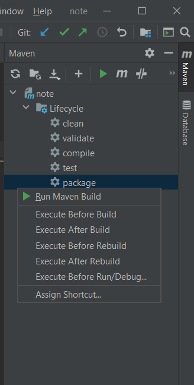

## Docker Setup
### Installing Docker (in Windows)

1. Download and install [Docker Desktop](https://www.docker.com/products/docker-desktop)
2. Your machine must have following features for Docker Desktop to function correctly.
    * Virtual Machine Platform (Hyper V, or Virtual Box, or similar)
    * [Windows Subsystem for Linux](https://docs.microsoft.com/en-us/windows/wsl/install-win10)
    * Virtualization enabled in the BIOS (we can check this by going to the `Performance` tab in the `Task Manager`)
    * Hypervisor enabled at Windows startup (A specific windows feature, enabling or disabling requires restart)
    
I solved my issues following this documentation for [Docker Troubleshooting](https://docs.docker.com/docker-for-windows/troubleshoot/)

### Creating a Dockerfile
**Dockerfile** is a file which consists of the build configurations and steps that execute internally while creating a docker image.

It is placed in the root directory where the project is located.

### Dockerfile for this application

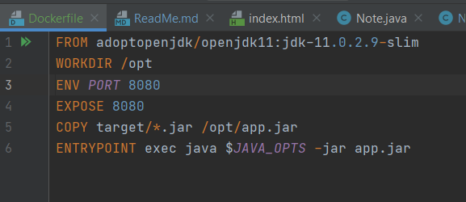

* `FROM` defines the base layer for the container, in this case, a version of OpenJDK 11
* `WORKDIR` sets the working directory to `/opt/`. Every subsequent instruction runs from within that folder
* `ENV` is used to set the environment variable
* `PORT 8080` makes the port of host to be 8080.
* `EXPOSE` tells that we are exposing our client side port to be 8080
* `COPY` simply copies the `JAR` file we created to `/opt/app.jar`
* `ENTRYPOINT` executes `java $JAVA_OPTS -jar app.jar` in the container as the starting point of whole process.

### Running Dockerfile
To run Dockerfile,
* Traverse to the directory where `Dockerfile` is.
* Run this build command. `-t` defines the `tag` name for your container. 
  Here, the tag name is `note-java` for the container.
```dockerfile
docker build -t note-java .
```
This build will be stored locally. We will discuss later how to send it to the remote.

Type `docker images` to list all images. We can see `note-java` image we just built.

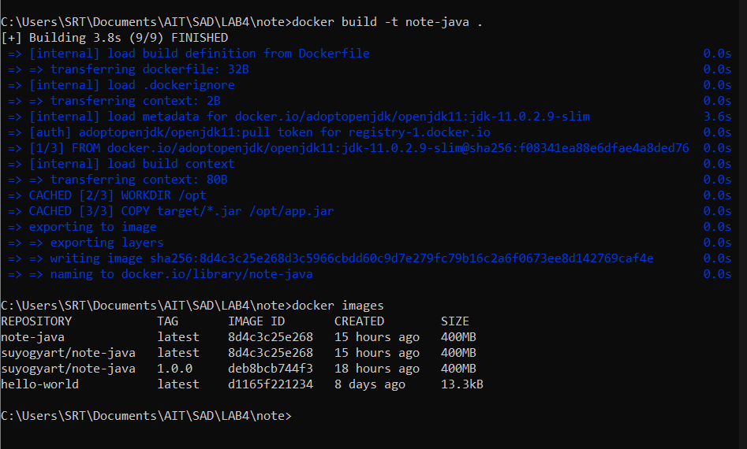

To run created Build,

```dockerfile
docker run --name <app_name> -p 8080:8080 <image_name>:<tag>
```

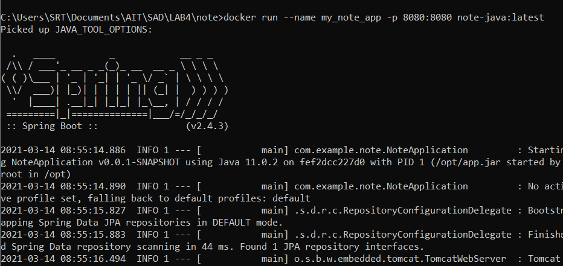

Then, after it is successfully run, we can see the app in our localhost in the web browser.

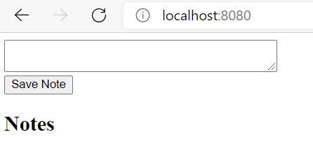

### Uploading our local container image to DockerHub Repository
* Create a Docker ID in [DockerHub](https://hub.docker.com/signup)
* In command line interface, do `docker login` and input your credentials.
* Images uploaded to DockerHub must have a name in the format `<username>/<image>:<tag>`
* Tag is often used to identify the version of the app, by default tag will be named `latest`
* For our local container image to be in this naming format, we need to rename it. 
Use this command to rename. 
```dockerfile
docker tag note-java suyogyart/note-java:1.0.0
```
Renaming not actually renames, but creates the another container image with the new name.
* Now we can push / upload our image into the DockerHub using this command.
```dockerfile
docker push suyogyart/note-java:1.0.0
```
>_**Note**: In these cases the **username** is 'suyogyart', **image** is 'note-java', **tag** is 1.0.0_

### Docker Hub
We can see our pushed repositories in the DockerHub.

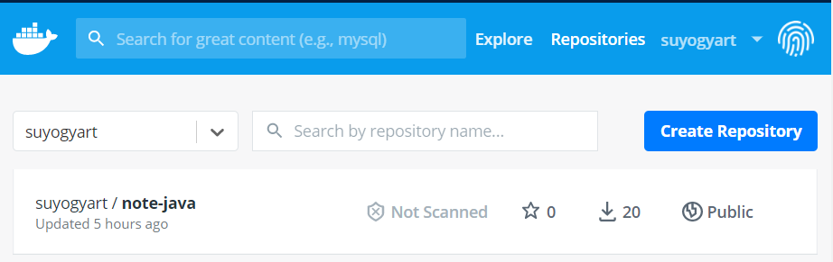

Before we can run from the docker hub, we need to understand following:

* When we execute `docker run ... ` command, it **deploys** the container and it starts running.
* We can **stop** the running container or **start** the stopped container
* If we execute `run` command again with the same name, then an error comes saying that the container with that name is already running.
* So we just need to start the already running container.
* We can see running processes using this command.
```dockerfile
docker ps -a
```
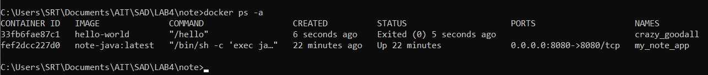

* Status of `Exited` means container is not running.
* Status of `Up` means container is running.

### Running the remote docker container image

Now, our app is containerized in the DockerHub and we can run our containerized app 
independent of the environment we are running.

The docker container image consists of all the dependencies required for the web app to run. These dependencies
are packaged while creation of the `JAR` file.

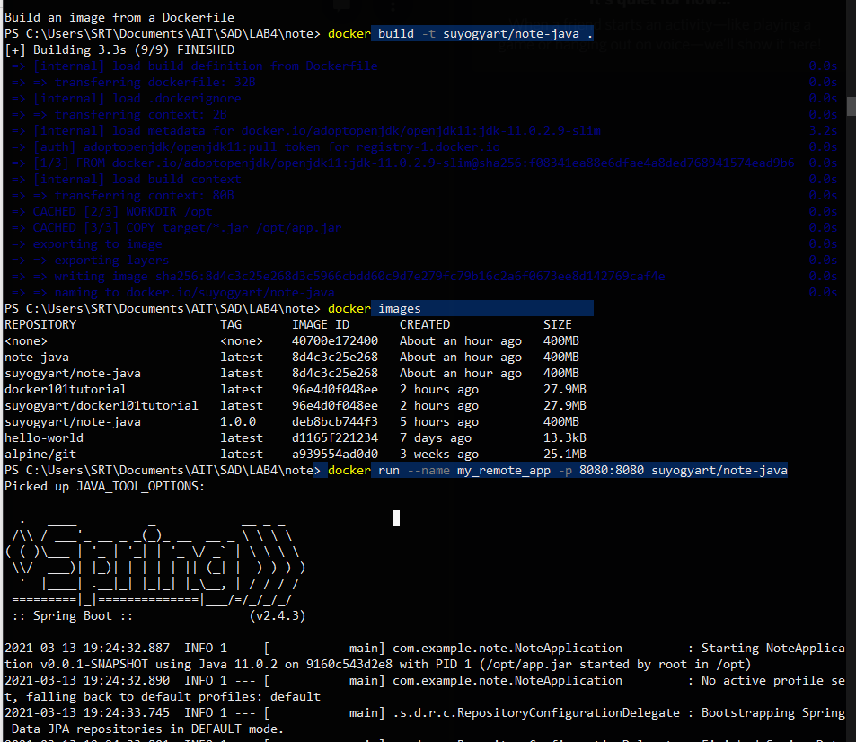

## Deploying docker container into Kubernetes

### Minikube
Minikube creates a single-node Kubernetes cluster running in a virtual machine.
Minikube cluster is mostly intended for testing purposes. For production, we may use Amazon Elastic Kubernetes, or
Google Kubernetes Service.

Minikube is a tool that lets us run Kubernetes locally. `minikube` runs a single-node Kubernetes cluster on our personal computer
(including Windows, macOS and Linux PCs) so that we can try out Kubernetes, or for daily development work.

### Install Kubernetes Client
#### Install kubectl (Kubernetes Command Line Tool)
`kubectl` allows us to run commands against Kubernetes clusters. We can use `kubectl` to deploy applications, 
inspect and manage cluster resources, and view logs. It is a primary Kubernetes CLI that we use for all interactions
with a Kubernetes cluster.

#### Installing using [Chocolatey](https://chocolatey.org/) package manager
* Install Chocolatey Package Manager for windows
* Follow this [Guide](https://kubernetes.io/docs/tasks/tools/install-kubectl-windows/#install-on-windows-using-chocolatey-or-scoop) to **Install kubectl using Choco**

### Install Minikube
#### Installing using Chocolatey Package Manager
```yaml
choco install minikube
```
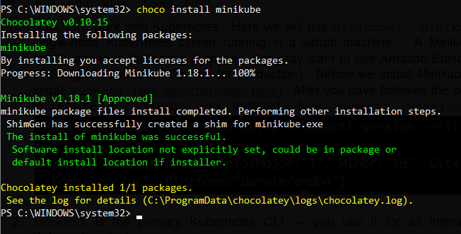

### Start Minikube with HyperV as a driver
This command creates a virtual machine and installs Kubernetes.
Make sure you have virtualization enabled in the BIOS for this process to succeed.
```yaml
minikube start --driver hyperv
```

Choose your driver based on the VMs you have like **virtualbox** or **hyperv**

##### My Installation procedure for Minikube


### Create Kubernetes YAML file
* Create a folder named `kube` in the application directory.
* This directory holds all the Kubernetes YAML files that we will create.

```yaml
apiVersion: apps/v1
kind: Deployment
metadata:
  name: note
spec:
  replicas: 1
  selector:
    matchLabels:
      app: note
  template:
    metadata:
      labels:
        app: note
    spec:
      containers:
        - name: note
          image: suyogyart/note-java:latest
          ports:
            - containerPort: 8080
---
apiVersion: v1
kind: Service
metadata:
  name: note
spec:
  selector:
    app: note
  ports:
    - port: 8080
      targetPort: 8080
      nodePort: 30001
  type: LoadBalancer
```

#### Creating YAML with kind: Deployment
The first 4 lines above define following:
* kind of resource: Deployment
* version of this resource type: apps/v1
* name of this specific resource: note

Next we have desired number of replicas. We don't usually talk using the term _containers_ in Kubernetes,
 instead we talk using the term **Pods**.

A `pod` is a wrapper around one or more containers. Most often a Pod contains only a single container.
However, for advanced use cases, a Pod may contain multiple containers. If a Pod contains multiple containers, they are treated
by Kubernetes as a unit. For example, they are started and stopped together and executed on the same node.
A Pod is the smallest unit of deployement in Kubernetes.

We don't directly work with containers, instead we work with Pods that wrap containers.


#### Creating YAML with kind: Service
The second part is the Service resource. It defines available service accessible from 
outside the cluster.

In above file, the first part is the selector according to their labels - this should correspond
to exactly to what we specified in our Deployment resource template/metadata>labels>app which is `note`.

### Running Minikube Cluster
Make sure that the minikube cluster is running by typing this command
```yaml
minikube status
```

If not running type `minikube start`

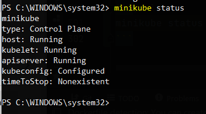

Now apply the resource definition with the following command.
This command submits all the YAML files in the `kube` directory to Kubernetes, and will create Pods.
```yaml
kubectl apply -f kube
```

Check that the pods are created successfully by typing this command.
```yaml
kubectl get pods
```

We can also type `kubectl get svc` to see services.

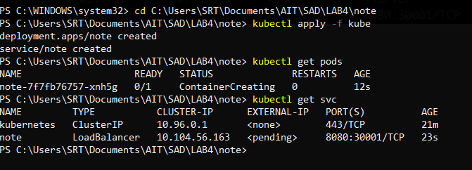

To launch the app, simple run `minikube service note`

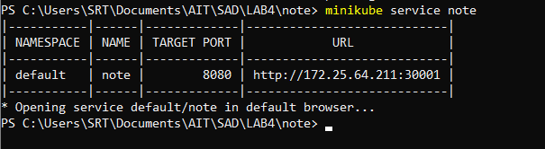

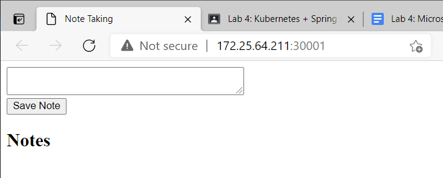

>**Simple Kubernetes App is ready !!!**